<head>

<script type="text/javascript"
  src="http://cdn.mathjax.org/mathjax/latest/MathJax.js?config=TeX-AMS-
MML_HTMLorMML">
</script>

</head>
<style>

@font-face {
    font-family: "Computer Modern";
    src: url('http://mirrors.ctan.org/fonts/cm-unicode/fonts/otf/cmunss.otf');
}
#notebook_panel { /* main background */
    background: #888;
    color: #f6f6f6;
}
#notebook li { /* More space between bullet points */
margin-top:0.8em;
}
div.text_cell_render{
    font-family: 'Arvo' sans-serif;
    line-height: 130%;
    font-size: 135%;
    width:1000px;
    margin-left:auto;
    margin-right:auto;
}

</style>


<center>

<p class="gap05"<p>
<h1>Intro to SQL:</h1>
<h2>Basic Theory and Basic Queries</h2>

<p class="gap05"<p>
<h3>Darrell Aucoin</h3>

<h3>Stats Club</h3>

<p class="gap2"<p>

</center>

<style type="text/css">
.input_prompt, .input_area, .output_prompt {
    display:none !important;
}
</style>
Source for picture: XKCD (Randall Munroe) http://xkcd.com/327/

## Content (This Presentation)

1. Motivation
2. Different Implementations of SQL
####Theory
1. Relational Databases
2. The E-R Model
3. Normalization
4. Primary and Foreign Keys
5. Relational Algebra Operations
6. Constraints
####How to Query in SQL
1. Data Types
2. Projection (SELECT Clause)
4. FROM Clause
3. Selection (WHERE Clause)

# How to Follow Along

#### Get the material  

1. Go to https://github.com/NormallySane/IntroSQL
2. Download [zip
file](https://github.com/NormallySane/IntroSQL/archive/master.zip)
    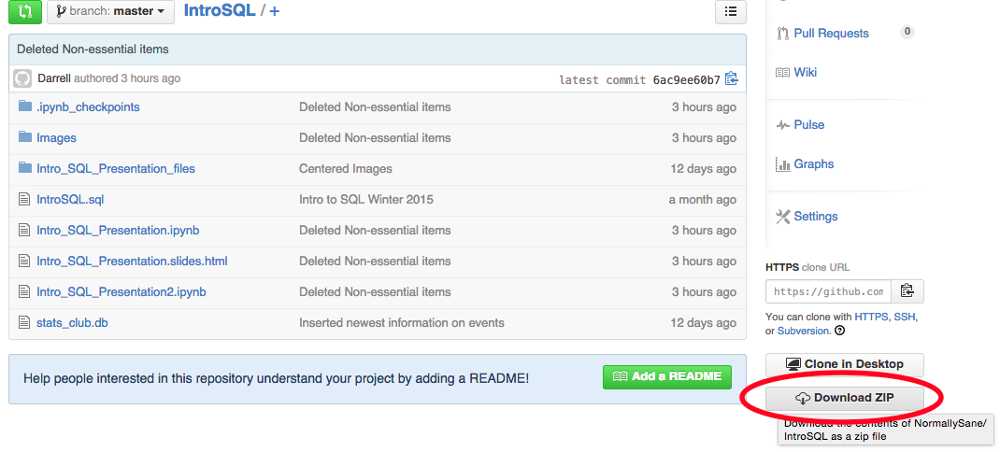
3. Unzip downloaded file in your preferred directory

#### Using SQLite Browser

1. Open SQLite browser
2. Open `stats_club.db` database file in the downloaded directory
3. Click on 'Execute SQL' tab
    1. Open SQL file `IntroSQL.sql` file in the downloaded directory
    2. Follow along with file, executing statement as topics dictate
4. Content of the talk is on https://github.com/NormallySane/IntroSQL/wiki (open
in your favorite browser)


- SQLite browser is a great tool for learning SQLite and SQL in general

#### Features of SQLite Browser

- Lets you see the data structure of tables in the database

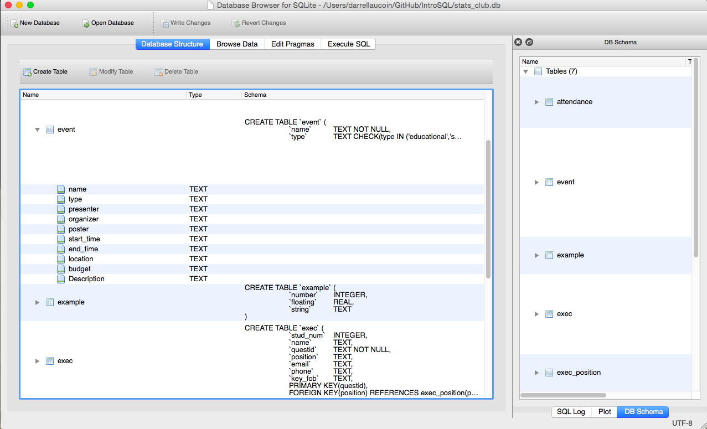

- Explore the data entered in tables


- Execute SQL statements and see results

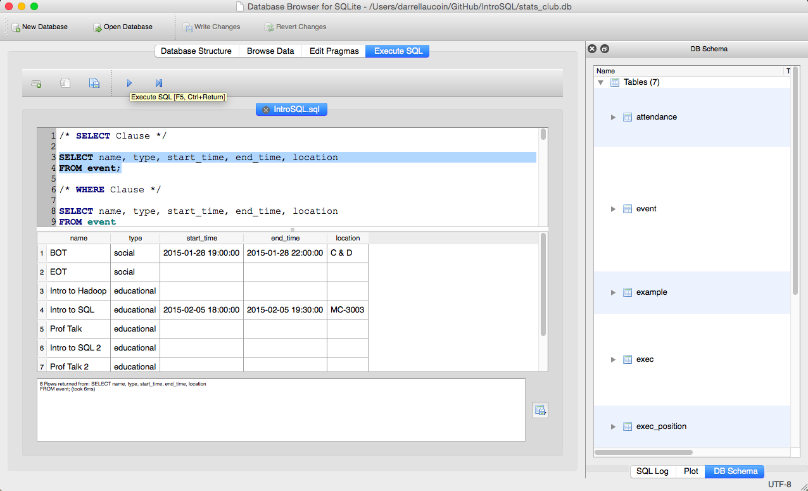

- Easily construction tables from files


- If the table is already created it will just import the data into the table,
otherwise it will create a new table

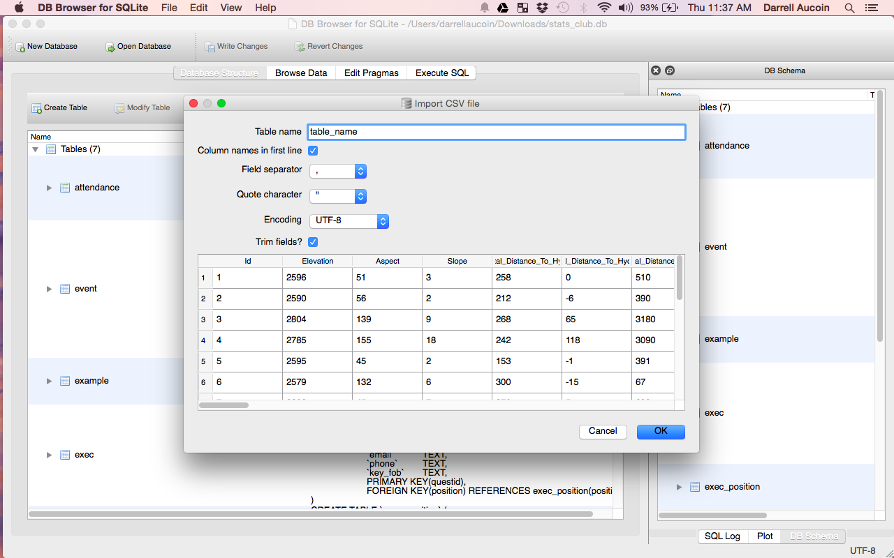

- SQLite functionality can also be extended by [various user created
extensions](http://www.sqlite.org/contrib)

# Motivation

__Q:__ Why learn a database lanugage?

- Data is rarely tidy as they are in many stats courses
- Most of the time the data we want (outside of assignments) is in a database

__Q:__ Why learn SQL?

- One of the most popular data analysis tools ([O'Reilly Data Scientist Survey
for 2014](http://www.oreilly.com/data/free/2014-data-science-salary-survey.csp))
- One of the most in-demand skills for 2014
([Workopolis](http://www.workopolis.com/content/advice/article/year-in-review-
the-most-in-demand-jobs-of-2014-and-the-fastest-declining-
occupations?CID=721:19L:14946))
- SQL not only can retrieve data, but can slice, dice and transform the data as
needed

__Q:__ What is SQL?

- A programming language allowing multiple concurrent users storing,
manipulating, and querying data stored in a relational database.
- Data does not necessary have to fit into memory.

__Q:__ Why use SQLite?

- Very easy to install
- Easy to share (database is a single file)
- Good  SQL language to practice with (can easily use it to preprocess data for
kaggle competitions)

## Different Implementations of SQL

__[MySQL](http://www.mysql.com/):__ Highly popular open source SQL
implementation.

__[PostgreSQL](http://www.postgresql.org/):__ Open source SQL designed around
letting users create User Defined Functions (UDF).

__[SQLite](http://www.sqlite.org/):__ Open sources light weight SQL usually used
as an embedded database for applications (web browsers, mobile applications,
etc.), or light to medium traffic websites. Database is saved as a single file
and __only allows one writer at a time__. Various OS's have SQLite preinstalled
(type `sqlite3` in terminal for mac)

__[Oracle](http://www.oracle.com/ca-en/database/overview/index.html):__ SQL
implementation produced and marketed by Oracle Corporation.

__[Microsoft SQL Server](http://www.microsoft.com/en-ca/server-cloud/products
/sql-server/):__ SQL implementation developed by Microsoft.

__[DB2](http://www-01.ibm.com/software/data/db2/):__ SQL developed by IBM. The
database used by University of Waterloo.

# Relational Databases

__Relational Database:__ A relational database is a system organized in tables
containing records (rows) related to other records in other tables. Each entity
having attributes (columns also called fields) which give additional information
on an entity.
<center>
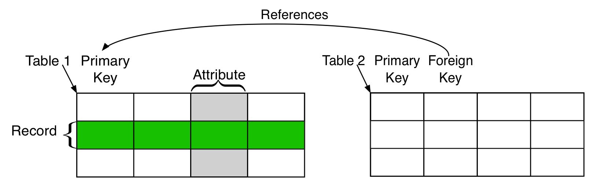
</center>

__Field, Attribute (Column)__: An individual piece of data stored in a table.

__Record (Row):__ A tuple of columns describing an entity or action of an
entity.

<center>

</center>

__Table:__ A collection of rows. Usually in reference a persistent table saved
permanently to memory

__Result set:__ A non-persistent table, usually the result of a query.

__(Virtual) View:__ A named query saved into memory and performed whenever it is
named. Some SQL servers have materialized views that permanently save the data
for faster access.

__Subquery:__ A query that returns a table to another query.

<center>

</center>

__Primary key:__ A tuple of columns that uniquely define each row in a table.

__Foreign key:__ A tuple of columns identifying a relationship to another table.

## The E-R Model

The E-R (entity-relationship) Model is an _analysis tool_ for relational
databases.
__E__ refers to _entity_: An object
__R__ refers to _relationship_: As in how objects relate to each other.

Each entity has properties associated with every instance of an object.
<center>
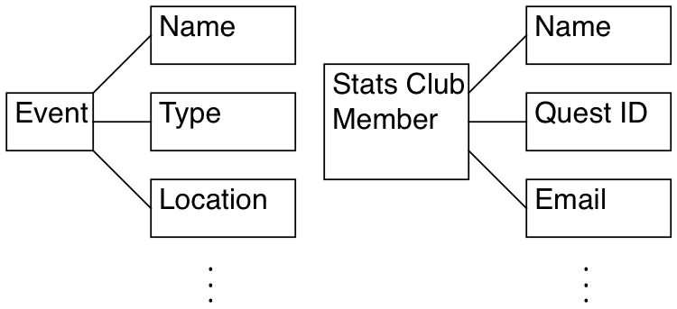
</center>

Objects are related to each other through relationships:
<center>
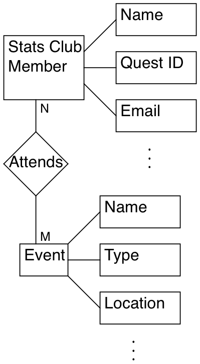
</center>

### E-R Relationships

1. __One to one relationships:__ For every instance of object A, there are
exactly one instance of object B.
    - Every student has exactly one quest account
2. __One to many relationships:__ For every instance of object A, there are an
indeterminate number of instances of object B.
    - A single course section has many students

3. __Many to one relationships:__ For many instances of object A, there are a
single instance of object B.
    - Many students are enrolled in a course section

4. __Many to many relationships:__ For many instances of object A, there are a
many possible instances of object B.
    - Many students take many courses

## Normalization

__Database Normalization__ is a process in relational databases to minimize
redundacy. Data can be constructed so that additions, deletions, and
modifications can be made in just one table.

Data goes through three forms until it is fully utilizied by a  relational
database:

1. __First Normalized Form:__ Each attribute contains only atomic values and
only a single value from that domain. i.e. The data is in the form of a table
with no merged columns or rows.
2. __Second Normalized Form:__ Each attribute in the table is dependent on the
entity it is describing (dependent on the primary key).
3. __Third Normalized Form:__ All non-primary key attributes are not determined
by any other non-primary key attributes.

__Example:__ For each event for Stats Club we have:
1. a list of attendies along with some basic information (email, ect.),
2. the event's name, type (social or education), the roles for Stats Club execs
for the event, time and location of the event, and a budget,
3. as well as a list of expenses for the event

A report of the event would look something like:
<center>
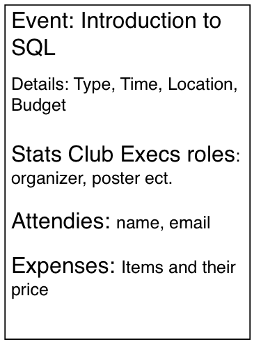
</center>

We first need to tabulate the data:
<center>

</center>
However this is not enough, the data is not in a form that can be easily
recognized by computers.
- How do you add new events?
- What about members that attend multiple events?
    - that attend no events?

### 1st Normalization

__First Normalized Form:__ Each attribute contains only atomic values and only a
single value from that domain

__Example:__ To bring the data into 1st normalized form we need to break the
table into two tables: Event, and Expenses:

<center>
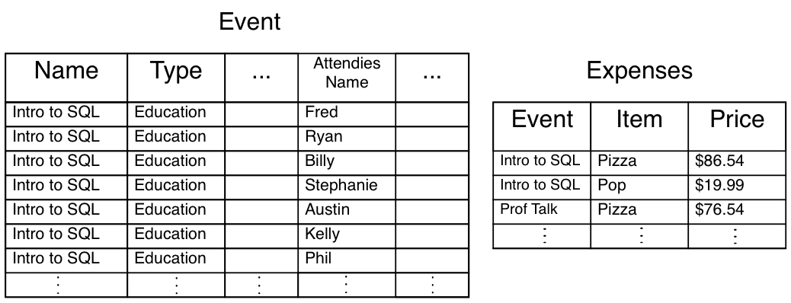
</center>

<center>

</center>
- This contains all of the information before but is more organized for the
computers to deal with
- Still not enough, a mispelling of an event or type could make the database
think there is a new event

### 2nd Normalization

__Second Normalized Form:__ Each attribute in the table is dependent on the
entity it is describing (dependent on the primary key).

__Example:__ To bring the data into 2nd normalized form, we need to break the
Event table again.
Let's break the table so we get important description of the events (name, type,
presenter, organizer, etc.) and a list of members that attended each event.

<center>

</center>

<center>

</center>
- Attendance is 2nd normalized form if we consider the primary key as the tuple
of event and quest ID.
- Attendance still has redundant information, several members can attend
multiple events or none at all

### 3rd Normalization

__Third Normalized Form:__ All non-primary key attributes are not determined by
any other non-primary key attributes.

__Example:__ The information on each member (name, email, etc.) is not
determined by the event. We need to break the attendance table to bring into 3rd
normalized form: attendance and members.

<center>
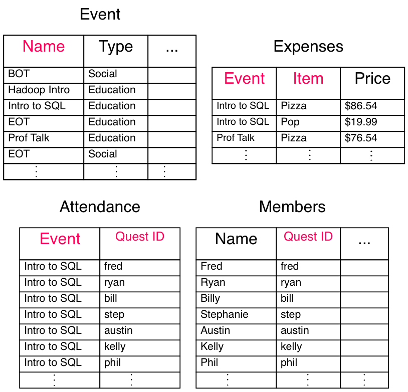
</center>

### Primary Keys and Foriegn Keys

We can reconstruct the orignal table by joining tables, foreign keys with what
they reference (primary keys).
- We can only construct an instance of a foreign keys if their is already an
instance of their reference
    - i.e. the set of foreign keys for one table is a subset of the primary keys
they reference

__Primary key:__ A tuple of columns that uniquely define each row in a table.
(Red items below)
__Foreign key:__ A tuple of columns identifying a relationship to another table.
(Blue items below)
<center>
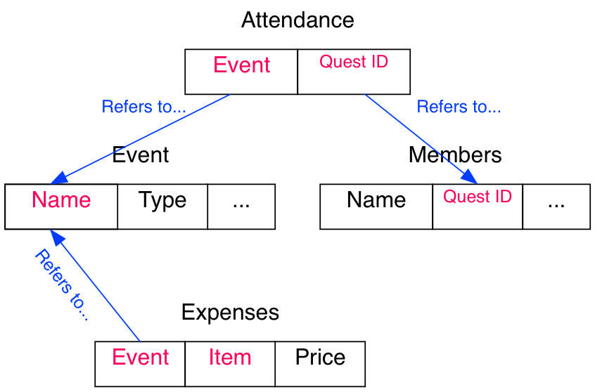
</center>

### Quiz: Normalization

Normalize the following table:

| Student Name | Quest ID | Course | Description | Section |
|--------------|----------|--------|-------------|---------|
| | | | | |

<center>
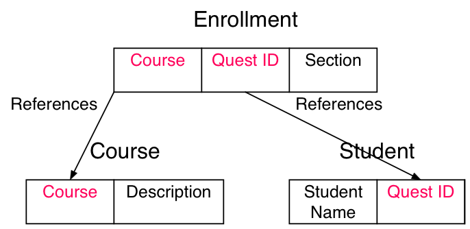
</center>

## Relational Algebra Operations

__Projection:__ Returns a subset of columns.

__Selection:__ Returns only entities where some condition is true.

__Rename:__ Rename an attribute.

__Natural Join:__ Tuples from one table is joined to tuples from another table
based on common attributes (at least one column with the same name and possible
values is common between them)

Θ__-Join and Equijoin:__ Join tuples from two different tables where some binary
condition (Θ = {≥, ≤, >, <, =}) between two tables attributes is true. When Θ is
=, the join is called an equijoin.
$$\theta=\left\{ \ge,\le,<,>,=\right\}$$

__Set Operations:__ Set theory's unions, set difference, and cartesian product
of tuples performed on tuples of different tables.

### Quiz: Relational Algebra

__Q1:__ What kind of operation is performed on the following table?
<center>
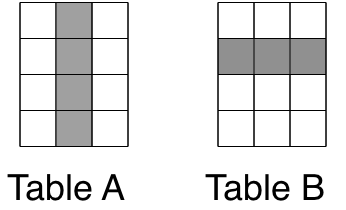
</center>

- Projection

__Q2:__ What kind of operation is performed on the following table?
<center>

</center>

- Selection

__Q3:__ What kinds of joins can be performed on tables?

- Natural Join: Join based on common columns
- Θ-Join: Join based on a comparison operator between two columns
    - Equijoin: Join based on equality between columns

## Constraints

Constraints limit what can be entered into fields in a table and help ensure
encapsulation:

__PRIMARY KEY constraints__  Uniquely identifies each record in a table (quickly
referencing it)

__FOREIGN KEY constraints__ Points to a PRIMARY KEY of another table, enabling
them to easily join them

__CHECK constraints__ Limits the range of values that a field can take.

__UNIQUE constraints__ Enforces uniqueness on an field (column).

__NOT NULL constraints__  Enforces a field to always contain a value.

- We can also create indexes for fields making them easily searchable

# SQL Language

- Case does not matter, for presentation purposes UPPER CASE is used for SQL key
words
- SQL statements are processed as a whole (ignoring white space and new lines)
and ends with a ';'

- We will be used a database based on Stats Club, supplied with fake data:
<center>

</center>

## Data Types

In SQLite3, there are 5 basic data types:

1. __INTEGER__ The value is a signed integer.

2. __REAL__ The value is a floating point value, stored as an 8-byte IEEE
floating point number.

3. __TEXT__ The value is a text string.

4. __BLOB__ The value is a blob of data, stored exactly as it was input.

5. __NUMERIC__ May contain integer or real values. The data is stored as text
but converted as necessary.

### SQL General Data Types

- Different implementations of SQL uses different datatypes but there are some
[general commonalities](http://www.w3schools.com/sql/sql_datatypes_general.asp):

| Data type | Description |
|-----------|-------------|
| CHAR(n) | Character string. Fixed length n |
| VARCHAR(n) | Character string.  Variable length <= n |
| BINARY(n) | Binary string. Fixed length n |
| BOOLEAN | TRUE or FALSE values |
| VARBINARY(n) | Binary string. Variable length <= n |
| INTEGER(p) | Integer numerical (no decimal). Precision p |
| SMALLINT | Integer numerical (no decimal). Precision 5 |
| INTEGER | Integer numerical (no decimal). Precision 10 |
| BIGINT | Integer numerical (no decimal). Precision 19 |
| DECIMAL(p,s) | Exact numerical. precision p, scale s |

| Data type | Description |
|-----------|-------------|
| NUMERIC(p,s) | Exact numerical. precision p, scale s |
| FLOAT(p) | Floating point number. mantissa precision p |
| REAL | Approximate numerical. Mantissa percision 7 |
| FLOAT | Approximate numerical. Mantissa percision 16 |
| DATE | Stores year, month, and day values |
| TIME | Stores hour, minute, and second values |
| TIMESTAMP | Stores year, month, day, hour, minute, and second values |

### NULL Values

__NULL__ A NULL can be thought of as an unknown value.
- Any datatype can have NULL values

- if either x or y is NULL:
$$x+y\implies\mbox{NULL}$$
$$x>y\implies\mbox{NULL}$$

SQL uses a three-value logic system: TRUE, FALSE, NULL:

| AND | TRUE | FALSE | NULL |
|-----|------|-------|------|
| TRUE | T | F | NULL |
| FALSE | F | F | F |
| NULL | NULL | F | NULL |

| OR | TRUE | FALSE | NULL |
|-----|------|-------|------|
| TRUE | T | T | T |
| FALSE | T | F | NULL |
| NULL | T | NULL | NULL |

| NOT | TRUE | FALSE | NULL |
|-----|------|-------|------|
|  | F | T | NULL |

## Projection (SELECT Clause)

__SELECT Statement:__ The SELECT statement returns a table of values (sometimes
empty) as specified in the statement.

__SELECT Clause:__ The SELECT clause of a SELECT statement specifies the columns
for the result set.
```
SELECT col1, col2, ...
FROM table_name;
```

- We can also specify all columns from a table

```
SELECT *
FROM table_name;
```

- If we leave out '`FROM table`' we are effectively taking from an empty table

In SELECT clauses, we can specify more than just columns from a table:
__Literials:__ Strings, numbers that are repeated for every row
__Expressions:__ Expressions of columns/literals
__Functions:__ Built in functions in SQL (ROUND(), etc.)
__User Defined Functions:__ Functions that a user can create within SQL to run

__Example:__ Let's try something simple: some literials and a calculation of `1
/ 2`

```
SELECT 1, 2, 'this is a string', 1/2;
```


    import pandas as pd
    import sqlite3 as sql
    con = sql.connect('stats_club.db')


    pd.read_sql_query(
    "SELECT 1, 2, 'this is a string', 1/2", con)


<div style="max-height:1000px;max-width:1500px;overflow:auto;">
<table border="1" class="dataframe">
  <thead>
    <tr style="text-align: right;">
      <th></th>
      <th>1</th>
      <th>2</th>
      <th>'this is a string'</th>
      <th>1/2</th>
    </tr>
  </thead>
  <tbody>
    <tr>
      <th>0</th>
      <td> 1</td>
      <td> 2</td>
      <td> this is a string</td>
      <td> 0</td>
    </tr>
  </tbody>
</table>
</div>


__Q:__ What happened here?

__A:__ Since 1 and 2 are both integers, the expression 1/2 returns an integer.
To get 0.5, we need to use a real number (a FLOAT).

```
SELECT 1, 2, 'this is a string', 1/2, 4/2, 5/2, 1/2., 1./2,
  1/CAST(2 AS FLOAT);
```


    pd.read_sql_query(
    "SELECT 1, 2, 'this is a string', 1/2, 4/2, 5/2, 1/2., 1./2, 1/CAST(2 AS FLOAT)", con)


<div style="max-height:1000px;max-width:1500px;overflow:auto;">
<table border="1" class="dataframe">
  <thead>
    <tr style="text-align: right;">
      <th></th>
      <th>1</th>
      <th>2</th>
      <th>'this is a string'</th>
      <th>1/2</th>
      <th>4/2</th>
      <th>5/2</th>
      <th>1/2.</th>
      <th>1./2</th>
      <th>1/CAST(2 AS FLOAT)</th>
    </tr>
  </thead>
  <tbody>
    <tr>
      <th>0</th>
      <td> 1</td>
      <td> 2</td>
      <td> this is a string</td>
      <td> 0</td>
      <td> 2</td>
      <td> 2</td>
      <td> 0.5</td>
      <td> 0.5</td>
      <td> 0.5</td>
    </tr>
  </tbody>
</table>
</div>


SQL statements ignore white spaces and new lines, the statement is only
processed when after it sees ';'

__Example:__ The following two statements produce the same table.

```
SELECT 1, 2, 'this is a string', 1/2;
```


    pd.read_sql_query(
    "SELECT 1, 2, 'this is a string', 1/2", con)


<div style="max-height:1000px;max-width:1500px;overflow:auto;">
<table border="1" class="dataframe">
  <thead>
    <tr style="text-align: right;">
      <th></th>
      <th>1</th>
      <th>2</th>
      <th>'this is a string'</th>
      <th>1/2</th>
    </tr>
  </thead>
  <tbody>
    <tr>
      <th>0</th>
      <td> 1</td>
      <td> 2</td>
      <td> this is a string</td>
      <td> 0</td>
    </tr>
  </tbody>
</table>
</div>


```
SELECT 1,
2,
             'this is a string',   1/2;
```


    pd.read_sql_query(
    "SELECT 1, \
    2, \
                 'this is a string',   1/2", con)


<div style="max-height:1000px;max-width:1500px;overflow:auto;">
<table border="1" class="dataframe">
  <thead>
    <tr style="text-align: right;">
      <th></th>
      <th>1</th>
      <th>2</th>
      <th>'this is a string'</th>
      <th>1/2</th>
    </tr>
  </thead>
  <tbody>
    <tr>
      <th>0</th>
      <td> 1</td>
      <td> 2</td>
      <td> this is a string</td>
      <td> 0</td>
    </tr>
  </tbody>
</table>
</div>


### SQL Functions

There are many functions in SQLite and each implementation of SQL have different
functions. Here are some random functions in SQLite:

| Function | Description |
|----------|-------------|
| __ABS(col)__ | Absolute value of numeric column |
| __LENGTH(col)__ | Return length of string column |
| __LOWER(col)__ | Return the string column in lower case |
| __UPPER(col)__ | Return the string column in upper case |
| __RANDOM()__ |        A pseudo-random integer between -9223372036854775808 and
+9223372036854775807 |

```
SELECT ABS(-8), LENGTH('This is a String'), LOWER('ThIS Is A StRiNg'),
  RANDOM();
```


    pd.read_sql_query(
    "SELECT ABS(-8), LENGTH('This is a String'), LOWER('ThIS Is A StRiNg'), RANDOM()", con)


<div style="max-height:1000px;max-width:1500px;overflow:auto;">
<table border="1" class="dataframe">
  <thead>
    <tr style="text-align: right;">
      <th></th>
      <th>ABS(-8)</th>
      <th>LENGTH('This is a String')</th>
      <th>LOWER('ThIS Is A StRiNg')</th>
      <th>RANDOM()</th>
    </tr>
  </thead>
  <tbody>
    <tr>
      <th>0</th>
      <td> 8</td>
      <td> 16</td>
      <td> this is a string</td>
      <td> 678548158552057334</td>
    </tr>
  </tbody>
</table>
</div>


There are many more [core functions](http://www.sqlite.org/lang_corefunc.html)
within SQLite.


    from IPython.display import HTML
    HTML('<iframe src=http://www.sqlite.org/lang_corefunc.html width=1000 height=600></iframe>')


<iframe src=http://www.sqlite.org/lang_corefunc.html width=1000 height=600></iframe>


### Quiz: SELECT Clause

Calculate the average of 2 random numbers.

```
SELECT (RANDOM() + RANDOM())/2.;
```


    pd.read_sql_query(
    "SELECT (RANDOM() + RANDOM())/2.", con)


<div style="max-height:1000px;max-width:1500px;overflow:auto;">
<table border="1" class="dataframe">
  <thead>
    <tr style="text-align: right;">
      <th></th>
      <th>(RANDOM() + RANDOM())/2.</th>
    </tr>
  </thead>
  <tbody>
    <tr>
      <th>0</th>
      <td> 3.292534e+18</td>
    </tr>
  </tbody>
</table>
</div>


__Q:__ What is the upper and lower case for the string __'UPPER or lower'__?

```
SELECT UPPER('UPPER or lower'), LOWER('UPPER or lower')
```


    pd.read_sql_query(
    "SELECT UPPER('UPPER or lower'), LOWER('UPPER or lower')", con)


<div style="max-height:1000px;max-width:1500px;overflow:auto;">
<table border="1" class="dataframe">
  <thead>
    <tr style="text-align: right;">
      <th></th>
      <th>UPPER('UPPER or lower')</th>
      <th>LOWER('UPPER or lower')</th>
    </tr>
  </thead>
  <tbody>
    <tr>
      <th>0</th>
      <td> UPPER OR LOWER</td>
      <td> upper or lower</td>
    </tr>
  </tbody>
</table>
</div>


## FROM Clause

__FROM Clause:__ Specifies the table: either a persistant table, or a result
set: a join of two or more tables or a subquery or some combination of the two.
```
SELECT col1, col2, ...
FROM table_name;
```

__Example:__ What are the names, type, times and locations for Stats Club?

```
SELECT name, type, start_time, end_time, location
FROM event;
```


    pd.read_sql_query(
    "SELECT name, type, start_time, end_time, location \
    FROM event", con)


<div style="max-height:1000px;max-width:1500px;overflow:auto;">
<table border="1" class="dataframe">
  <thead>
    <tr style="text-align: right;">
      <th></th>
      <th>name</th>
      <th>type</th>
      <th>start_time</th>
      <th>end_time</th>
      <th>location</th>
    </tr>
  </thead>
  <tbody>
    <tr>
      <th>0</th>
      <td>                            BOT</td>
      <td>      social</td>
      <td> 2015-01-28 19:00:00</td>
      <td> 2015-01-28 22:00:00</td>
      <td>   C &amp; D</td>
    </tr>
    <tr>
      <th>1</th>
      <td>                            EOT</td>
      <td>      social</td>
      <td>                None</td>
      <td>                None</td>
      <td>    None</td>
    </tr>
    <tr>
      <th>2</th>
      <td>                Intro to Hadoop</td>
      <td> educational</td>
      <td>                None</td>
      <td>                None</td>
      <td>    None</td>
    </tr>
    <tr>
      <th>3</th>
      <td>                   Intro to SQL</td>
      <td> educational</td>
      <td> 2015-02-05 18:00:00</td>
      <td> 2015-02-05 19:30:00</td>
      <td> MC-3003</td>
    </tr>
    <tr>
      <th>4</th>
      <td>                      Prof Talk</td>
      <td> educational</td>
      <td>                None</td>
      <td>                None</td>
      <td>    None</td>
    </tr>
    <tr>
      <th>5</th>
      <td>                    Prof Talk 2</td>
      <td> educational</td>
      <td>                None</td>
      <td>                None</td>
      <td>    None</td>
    </tr>
    <tr>
      <th>6</th>
      <td>                    Prof Talk 3</td>
      <td> educational</td>
      <td>                None</td>
      <td>                None</td>
      <td>    None</td>
    </tr>
    <tr>
      <th>7</th>
      <td>    Intro to SQL: Basic Queries</td>
      <td> educational</td>
      <td> 2015-03-09 18:00:00</td>
      <td> 2015-03-09 19:30:00</td>
      <td> MC-3003</td>
    </tr>
    <tr>
      <th>8</th>
      <td> Intro to SQL: Advanced Queries</td>
      <td> educational</td>
      <td> 2015-03-12 18:00:00</td>
      <td> 2015-03-12 19:30:00</td>
      <td> MC-3003</td>
    </tr>
  </tbody>
</table>
</div>


### Quiz: FROM Clause

__Q:__ Who are the execs for Stats Club, and what are their positions, and
emails?
- Projection of name, position, and email from the table exec

```
SELECT name, position, email
FROM exec;
```


    pd.read_sql_query(
    "SELECT name, position, email \
    FROM exec", con)


<div style="max-height:1000px;max-width:1500px;overflow:auto;">
<table border="1" class="dataframe">
  <thead>
    <tr style="text-align: right;">
      <th></th>
      <th>name</th>
      <th>position</th>
      <th>email</th>
    </tr>
  </thead>
  <tbody>
    <tr>
      <th>0</th>
      <td>    Darrell Aucoin</td>
      <td>     President</td>
      <td> darrell.aucoin@gmail.com</td>
    </tr>
    <tr>
      <th>1</th>
      <td> Judith B. Gibbons</td>
      <td>        Events</td>
      <td>      judith@uwaterloo.ca</td>
    </tr>
    <tr>
      <th>2</th>
      <td>         Lamar Roy</td>
      <td>       Finance</td>
      <td>       lamar@uwaterloo.ca</td>
    </tr>
    <tr>
      <th>3</th>
      <td>    Gilberto Cross</td>
      <td>        Events</td>
      <td>    gilberto@uwaterloo.ca</td>
    </tr>
    <tr>
      <th>4</th>
      <td>        Melba Lane</td>
      <td>     President</td>
      <td>       melba@uwaterloo.ca</td>
    </tr>
    <tr>
      <th>5</th>
      <td>        Ruben Lamb</td>
      <td>    Technology</td>
      <td>       ruben@uwaterloo.ca</td>
    </tr>
    <tr>
      <th>6</th>
      <td>      Hannah Mason</td>
      <td> SeniorAdvisor</td>
      <td>      hannah@uwaterloo.ca</td>
    </tr>
    <tr>
      <th>7</th>
      <td> Patrick Robertson</td>
      <td>        Events</td>
      <td>     patrick@uwaterloo.ca</td>
    </tr>
    <tr>
      <th>8</th>
      <td>     Dominick Byrd</td>
      <td>        Events</td>
      <td>    dominick@uwaterloo.ca</td>
    </tr>
  </tbody>
</table>
</div>


## Aggregate Functions

__Aggregate Functions:__ Takes in the columns of a table and aggregates over the
entries.

| Function | Return value |
|----------|--------------|
| AVG(column) | Average of non-null values |
| COUNT(column) | Count of non-null values |
| MAX(column) | Maximum of values |
| MIN(column) | Minimum of values |
| SUM(column) | Sum of values |
| GROUP_CONCAT(column) | Concatenation of column strings |

- There are more aggregate functions for other implementations of SQL

More detailed descriptions of the aggregate functions within SQLite can be found
[here](http://www.sqlite.org/lang_aggfunc.html).

```
SELECT COUNT( 12 ), COUNT('ssdf'), COUNT(NULL), SUM(23), SUM(0), SUM(NULL),
  AVG(0), AVG(NULL);
```


    pd.read_sql_query(
    "SELECT COUNT( 12 ), COUNT('ssdf'), COUNT(NULL), SUM(23), SUM(0), SUM(NULL), AVG(0), AVG(NULL)", con)


<div style="max-height:1000px;max-width:1500px;overflow:auto;">
<table border="1" class="dataframe">
  <thead>
    <tr style="text-align: right;">
      <th></th>
      <th>COUNT( 12 )</th>
      <th>COUNT('ssdf')</th>
      <th>COUNT(NULL)</th>
      <th>SUM(23)</th>
      <th>SUM(0)</th>
      <th>SUM(NULL)</th>
      <th>AVG(0)</th>
      <th>AVG(NULL)</th>
    </tr>
  </thead>
  <tbody>
    <tr>
      <th>0</th>
      <td> 1</td>
      <td> 1</td>
      <td> 0</td>
      <td> 23</td>
      <td> 0</td>
      <td> None</td>
      <td> 0</td>
      <td> None</td>
    </tr>
  </tbody>
</table>
</div>


Lets work with some aggregate functions with the '`example`' table below:


    pd.read_sql_query(
    "SELECT * \
    FROM example", con)


<div style="max-height:1000px;max-width:1500px;overflow:auto;">
<table border="1" class="dataframe">
  <thead>
    <tr style="text-align: right;">
      <th></th>
      <th>number</th>
      <th>floating</th>
      <th>string</th>
    </tr>
  </thead>
  <tbody>
    <tr>
      <th>0</th>
      <td>    1</td>
      <td> 23.23</td>
      <td>         this</td>
    </tr>
    <tr>
      <th>1</th>
      <td> 3232</td>
      <td>-21.23</td>
      <td>           is</td>
    </tr>
    <tr>
      <th>2</th>
      <td>   11</td>
      <td> -2.00</td>
      <td>            a</td>
    </tr>
    <tr>
      <th>3</th>
      <td>  -23</td>
      <td> 54.00</td>
      <td>       string</td>
    </tr>
    <tr>
      <th>4</th>
      <td>    2</td>
      <td>   NaN</td>
      <td> concatenated</td>
    </tr>
  </tbody>
</table>
</div>


```
SELECT COUNT(*), COUNT(string), COUNT(floating), AVG(number), SUM(number),
GROUP_CONCAT(string, ' ')
FROM example;
```


    pd.read_sql_query(
    "SELECT COUNT(*), COUNT(string), COUNT(floating), AVG(number), SUM(number), GROUP_CONCAT(string, ' ') \
    FROM example", con)


<div style="max-height:1000px;max-width:1500px;overflow:auto;">
<table border="1" class="dataframe">
  <thead>
    <tr style="text-align: right;">
      <th></th>
      <th>COUNT(*)</th>
      <th>COUNT(string)</th>
      <th>COUNT(floating)</th>
      <th>AVG(number)</th>
      <th>SUM(number)</th>
      <th>GROUP_CONCAT(string, ' ')</th>
    </tr>
  </thead>
  <tbody>
    <tr>
      <th>0</th>
      <td> 5</td>
      <td> 5</td>
      <td> 4</td>
      <td> 644.6</td>
      <td> 3223</td>
      <td> this is a string concatenated</td>
    </tr>
  </tbody>
</table>
</div>


### DISTINCT Prefix

In the SELECT clause we can specify to return only distinct tuples of columns
```
SELECT DISTINCT col1, col2, ...
FROM table_name;
```
- We can also use DISTINCT within aggregate functions making them only aggregate
over distinct entries
```
SELECT aggregate_function(DISTINCT column_name)
FROM table_name;
```

__Example:__ What events have members attended?
- What are the distinct events where at least one member attended?

```
SELECT DISTINCT event
FROM attendance;
```


    pd.read_sql_query(
    "SELECT DISTINCT event \
    FROM attendance", con)


<div style="max-height:1000px;max-width:1500px;overflow:auto;">
<table border="1" class="dataframe">
  <thead>
    <tr style="text-align: right;">
      <th></th>
      <th>event</th>
    </tr>
  </thead>
  <tbody>
    <tr>
      <th>0</th>
      <td>                   Intro to SQL</td>
    </tr>
    <tr>
      <th>1</th>
      <td>                            BOT</td>
    </tr>
    <tr>
      <th>2</th>
      <td>                            EOT</td>
    </tr>
    <tr>
      <th>3</th>
      <td>                Intro to Hadoop</td>
    </tr>
    <tr>
      <th>4</th>
      <td>    Intro to SQL: Basic Queries</td>
    </tr>
    <tr>
      <th>5</th>
      <td>                      Prof Talk</td>
    </tr>
    <tr>
      <th>6</th>
      <td>                    Prof Talk 2</td>
    </tr>
    <tr>
      <th>7</th>
      <td> Intro to SQL: Advanced Queries</td>
    </tr>
  </tbody>
</table>
</div>


### Quiz: DISTINCT

__Q:__ What are the __distinct__ majors of Stats Club members?

```
SELECT DISTINCT major
FROM member;
```


    pd.read_sql_query(
    "SELECT DISTINCT major \
    FROM member", con)


<div style="max-height:1000px;max-width:1500px;overflow:auto;">
<table border="1" class="dataframe">
  <thead>
    <tr style="text-align: right;">
      <th></th>
      <th>major</th>
    </tr>
  </thead>
  <tbody>
    <tr>
      <th>0</th>
      <td>        Stats</td>
    </tr>
    <tr>
      <th>1</th>
      <td>    Pure Math</td>
    </tr>
    <tr>
      <th>2</th>
      <td>           CS</td>
    </tr>
    <tr>
      <th>3</th>
      <td> Applied Math</td>
    </tr>
    <tr>
      <th>4</th>
      <td>      Act Sci</td>
    </tr>
    <tr>
      <th>5</th>
      <td>        C &amp; O</td>
    </tr>
    <tr>
      <th>6</th>
      <td>         Econ</td>
    </tr>
  </tbody>
</table>
</div>


__Q:__ How many __distinct__ majors of Stats Club members are there?

- DISTINCT can be within aggregate functions

```
SELECT COUNT(DISTINCT major)
FROM member;
```


    pd.read_sql_query(
    "SELECT COUNT(DISTINCT major) \
    FROM member", con)


<div style="max-height:1000px;max-width:1500px;overflow:auto;">
<table border="1" class="dataframe">
  <thead>
    <tr style="text-align: right;">
      <th></th>
      <th>COUNT(DISTINCT major)</th>
    </tr>
  </thead>
  <tbody>
    <tr>
      <th>0</th>
      <td> 7</td>
    </tr>
  </tbody>
</table>
</div>


### Alias

#### Column Alias

To increase the readability of SQL as well as the result set, we can give
columns new names:
```
SELECT col AS new_name
FROM table_name;
```
- Column aliases make the final table more readiable and workiable for
subqueries

__Example:__ If we give column aliases for the previous table, we make the
result more interpretiable:

```
SELECT COUNT(*) AS num_rows, COUNT(string) AS num_strings,
  COUNT(floating) AS num_float, AVG(number) AS avg_integer,
  SUM(number) AS sum_int, GROUP_CONCAT(string, ' ') AS cat_string
FROM example;
```


    pd.read_sql_query(
    "SELECT COUNT(*) AS num_rows, COUNT(string) AS num_strings, \
    COUNT(floating) AS num_float, AVG(number) AS avg_integer, \
    SUM(number) AS sum_int, GROUP_CONCAT(string, ' ') AS cat_string \
    FROM example", con)


<div style="max-height:1000px;max-width:1500px;overflow:auto;">
<table border="1" class="dataframe">
  <thead>
    <tr style="text-align: right;">
      <th></th>
      <th>num_rows</th>
      <th>num_strings</th>
      <th>num_float</th>
      <th>avg_integer</th>
      <th>sum_int</th>
      <th>cat_string</th>
    </tr>
  </thead>
  <tbody>
    <tr>
      <th>0</th>
      <td> 5</td>
      <td> 5</td>
      <td> 4</td>
      <td> 644.6</td>
      <td> 3223</td>
      <td> this is a string concatenated</td>
    </tr>
  </tbody>
</table>
</div>


#### Table Alias

We can also give tables new names as well:
```
SELECT table_alias_1.col_name, table_alias_2.col_name, ...
FROM table_1 AS table_alias_1, table_2 AS table_alias_2;
```
- Very useful when tables have common column names

__Note:__ We can reference what table a column is coming from by a '.'
```python
table_name.column_name
```

###  Quiz: Aliases

Perform a query using a table alias, and use this table alias when referencing
the column i.e. `table_alias.column_name`
- This will be really important for bigger, more complicated queries

```
SELECT e.name, e.start_time, e.location, e.Description
FROM event AS e;
```


    pd.read_sql_query(
    "SELECT e.name, e.start_time, e.location, e.Description \
    FROM event AS e", con)


<div style="max-height:1000px;max-width:1500px;overflow:auto;">
<table border="1" class="dataframe">
  <thead>
    <tr style="text-align: right;">
      <th></th>
      <th>name</th>
      <th>start_time</th>
      <th>location</th>
      <th>Description</th>
    </tr>
  </thead>
  <tbody>
    <tr>
      <th>0</th>
      <td>                            BOT</td>
      <td> 2015-01-28 19:00:00</td>
      <td>   C &amp; D</td>
      <td> Come and play games with your fellow stats Clu...</td>
    </tr>
    <tr>
      <th>1</th>
      <td>                            EOT</td>
      <td>                None</td>
      <td>    None</td>
      <td> End of Term social at a local Pub. A joint eve...</td>
    </tr>
    <tr>
      <th>2</th>
      <td>                Intro to Hadoop</td>
      <td>                None</td>
      <td>    None</td>
      <td> Hadoop is a distributed computing system desig...</td>
    </tr>
    <tr>
      <th>3</th>
      <td>                   Intro to SQL</td>
      <td> 2015-02-05 18:00:00</td>
      <td> MC-3003</td>
      <td> SQL is a relational database language and alon...</td>
    </tr>
    <tr>
      <th>4</th>
      <td>                      Prof Talk</td>
      <td>                None</td>
      <td>    None</td>
      <td>                                              None</td>
    </tr>
    <tr>
      <th>5</th>
      <td>                    Prof Talk 2</td>
      <td>                None</td>
      <td>    None</td>
      <td>                                              None</td>
    </tr>
    <tr>
      <th>6</th>
      <td>                    Prof Talk 3</td>
      <td>                None</td>
      <td>    None</td>
      <td>                                              None</td>
    </tr>
    <tr>
      <th>7</th>
      <td>    Intro to SQL: Basic Queries</td>
      <td> 2015-03-09 18:00:00</td>
      <td> MC-3003</td>
      <td> SQL is a relational database language and alon...</td>
    </tr>
    <tr>
      <th>8</th>
      <td> Intro to SQL: Advanced Queries</td>
      <td> 2015-03-12 18:00:00</td>
      <td> MC-3003</td>
      <td> SQL is a relational database language and alon...</td>
    </tr>
  </tbody>
</table>
</div>


## Selection (WHERE Clause)

__WHERE__ clauses filters the result set, removing rows where the condition
returns either FALSE or NULL.

```
SELECT col1, col2, ...
FROM table_name
WHERE condition;
```

__Example:__ What Stats Club events are social?

```
SELECT name, type, start_time, end_time, location
FROM event
WHERE type = 'social';
```


    pd.read_sql_query(
    "SELECT name, type, start_time, end_time, location \
    FROM event \
    WHERE type = 'social'", con)


<div style="max-height:1000px;max-width:1500px;overflow:auto;">
<table border="1" class="dataframe">
  <thead>
    <tr style="text-align: right;">
      <th></th>
      <th>name</th>
      <th>type</th>
      <th>start_time</th>
      <th>end_time</th>
      <th>location</th>
    </tr>
  </thead>
  <tbody>
    <tr>
      <th>0</th>
      <td> BOT</td>
      <td> social</td>
      <td> 2015-01-28 19:00:00</td>
      <td> 2015-01-28 22:00:00</td>
      <td> C &amp; D</td>
    </tr>
    <tr>
      <th>1</th>
      <td> EOT</td>
      <td> social</td>
      <td>                None</td>
      <td>                None</td>
      <td>  None</td>
    </tr>
  </tbody>
</table>
</div>


### Prediate Operators

| Operator | Description | Example |
|----------|-------------|---------|
| = | Equal to | WHERE gender = 'M' |
| <>, != | Not equal to | WHERE gender <> 'M' |
| > | Greater than | WHERE num > 5 |
| < | Less than | WHERE num < 5 |
| >= | Greater than or equal to | WHERE num >= 5 |
| <= | Less than or equal to | WHERE num <= 5 |
| IS NULL | Value is NULL | WHERE num IS NULL |
| IS NOT NULL | Value is not NULL | WHERE num IS NOT NULL |
| BETWEEN | Between a range | WHERE num BETWEEN 3 AND 5 |
| IN | In a list of values | WHERE num IN (3, 5, 8) |
| LIKE | Pattern Search | WHERE str LIKE 'F%' |
| EXISTS | Subquery have any rows? | WHERE EXISTS (subquery) |

#### LIKE Predicate

LIKE predicates

'\_' means a character of any type
'%' means between 0 or more characters of any type

__Example:__ What Stats Club members has a name begining with F?

```
SELECT *
FROM member
WHERE name LIKE 'F%';
```


    pd.read_sql_query(
    "SELECT * \
    FROM member \
    WHERE name LIKE 'F%'", con)


<div style="max-height:1000px;max-width:1500px;overflow:auto;">
<table border="1" class="dataframe">
  <thead>
    <tr style="text-align: right;">
      <th></th>
      <th>quest_id</th>
      <th>name</th>
      <th>email</th>
      <th>faculty</th>
      <th>major</th>
      <th>paid</th>
      <th>card</th>
    </tr>
  </thead>
  <tbody>
    <tr>
      <th>0</th>
      <td>    fred</td>
      <td>     Fred E. Finch</td>
      <td>    fred@uwaterloo.ca</td>
      <td> Math</td>
      <td> Pure Math</td>
      <td> Y</td>
      <td> Y</td>
    </tr>
    <tr>
      <th>1</th>
      <td> frances</td>
      <td> Frances A. Miller</td>
      <td> frances@uwaterloo.ca</td>
      <td> Math</td>
      <td>     Stats</td>
      <td> Y</td>
      <td> Y</td>
    </tr>
  </tbody>
</table>
</div>


#### Operator Modifiers

##### ALL, ANY or SOME Operator Modifiers

The operators =, <>, !=, >, <, >=, <= can be used with a list of values and the
operators `ALL` or `ANY / SOME`.

- SQLite does __NOT__ have `ALL` or `ANY / SOME` implemented

__ANY, SOME__ Operator returns true, if operator is true for any value in the
set.

$$E_{1}\vee E_{2}\vee E_{3}\vee\cdots\vee E_{n}$$

__ALL__ Operator returns true, if operator is true for any value in the set.

$$E_{1}\vee E_{2}\vee E_{3}\vee\cdots\vee E_{n}$$

```
SELECT *
FROM table_name
WHERE column_name < ALL (subquery_returning_one_column);
```

##### AND, OR Operators

A group of filter conditions can be linked together with AND or OR operators.

```
SELECT col1, col2, ...
FROM table_name
WHERE (condition1 AND condition2 ) OR condition3;
```

__Example:__ What Stats Club members has a name with it's second letter as A or
ends in B?

```
SELECT name
FROM member
WHERE name LIKE '_a%' OR  name LIKE '%b';
```


    pd.read_sql_query(
    "SELECT name \
    FROM member \
    WHERE name LIKE '_a%' OR  name LIKE '%b'", con)


<div style="max-height:1000px;max-width:1500px;overflow:auto;">
<table border="1" class="dataframe">
  <thead>
    <tr style="text-align: right;">
      <th></th>
      <th>name</th>
    </tr>
  </thead>
  <tbody>
    <tr>
      <th>0</th>
      <td>      Darrell Aucoin</td>
    </tr>
    <tr>
      <th>1</th>
      <td>    James M. Eddings</td>
    </tr>
    <tr>
      <th>2</th>
      <td>       James A. Foxt</td>
    </tr>
    <tr>
      <th>3</th>
      <td>     Daniel J. Moore</td>
    </tr>
    <tr>
      <th>4</th>
      <td>    Nancy P. Jackson</td>
    </tr>
    <tr>
      <th>5</th>
      <td>    Ralph L. Waldrop</td>
    </tr>
    <tr>
      <th>6</th>
      <td> Tameika M. McMaster</td>
    </tr>
    <tr>
      <th>7</th>
      <td>    Janelle T. Smith</td>
    </tr>
    <tr>
      <th>8</th>
      <td>          Ruben Lamb</td>
    </tr>
    <tr>
      <th>9</th>
      <td>   Patrick Robertson</td>
    </tr>
  </tbody>
</table>
</div>


### Quiz: Filtering (WHERE Clause)

__Q:__ What events for Stats Club are introductory talks?
- Introductory talk names start with 'Intro'

```
SELECT name
FROM event
WHERE name LIKE 'Intro%';
```


    pd.read_sql_query(
    "SELECT name \
    FROM event \
    WHERE name LIKE 'Intro%'", con)


<div style="max-height:1000px;max-width:1500px;overflow:auto;">
<table border="1" class="dataframe">
  <thead>
    <tr style="text-align: right;">
      <th></th>
      <th>name</th>
    </tr>
  </thead>
  <tbody>
    <tr>
      <th>0</th>
      <td>                Intro to Hadoop</td>
    </tr>
    <tr>
      <th>1</th>
      <td>                   Intro to SQL</td>
    </tr>
    <tr>
      <th>2</th>
      <td> Intro to SQL: Advanced Queries</td>
    </tr>
    <tr>
      <th>3</th>
      <td>    Intro to SQL: Basic Queries</td>
    </tr>
  </tbody>
</table>
</div>


__Q:__ What Stats Club members have their first name starting with a letter
__BETWEEN__ A and G?

```
SELECT name
FROM member
WHERE name BETWEEN 'A' AND 'G';
```


    pd.read_sql_query(
    "SELECT name \
    FROM member \
    WHERE name BETWEEN 'A' AND 'G'", con)


<div style="max-height:1000px;max-width:1500px;overflow:auto;">
<table border="1" class="dataframe">
  <thead>
    <tr style="text-align: right;">
      <th></th>
      <th>name</th>
    </tr>
  </thead>
  <tbody>
    <tr>
      <th>0 </th>
      <td>      Darrell Aucoin</td>
    </tr>
    <tr>
      <th>1 </th>
      <td>       Fred E. Finch</td>
    </tr>
    <tr>
      <th>2 </th>
      <td>     Billy L. Hunter</td>
    </tr>
    <tr>
      <th>3 </th>
      <td>  Austin K. Gilliard</td>
    </tr>
    <tr>
      <th>4 </th>
      <td>       Elaine S. Ott</td>
    </tr>
    <tr>
      <th>5 </th>
      <td>     Daniel J. Moore</td>
    </tr>
    <tr>
      <th>6 </th>
      <td>   Frances A. Miller</td>
    </tr>
    <tr>
      <th>7 </th>
      <td> Deborah D. Helfrich</td>
    </tr>
    <tr>
      <th>8 </th>
      <td>   Bobbie D. Mathews</td>
    </tr>
    <tr>
      <th>9 </th>
      <td>    Arnold J. Fuller</td>
    </tr>
    <tr>
      <th>10</th>
      <td>   Ann W. McLaughlin</td>
    </tr>
    <tr>
      <th>11</th>
      <td>       Dominick Byrd</td>
    </tr>
  </tbody>
</table>
</div>


# Questions?
### Topics Covered in Next Presentation
1. Aggregation (GROUP BY)
2. Joining tables
3. Subqueries
4. Set Operations
5. WITH Clause (Increases Readiablity)
6. CASE expressions
7. ORDER BY Clause
8. LIMIT Clause

## Further Practice Questions?

### Quiz: Practice Questions

__Q:__ What events have dates specified?

```
SELECT name, start_time
FROM event
WHERE start_time IS NOT NULL;
```


    pd.read_sql_query(
    "SELECT name, start_time \
    FROM event \
    WHERE start_time IS NOT NULL", con)


<div style="max-height:1000px;max-width:1500px;overflow:auto;">
<table border="1" class="dataframe">
  <thead>
    <tr style="text-align: right;">
      <th></th>
      <th>name</th>
      <th>start_time</th>
    </tr>
  </thead>
  <tbody>
    <tr>
      <th>0</th>
      <td>                            BOT</td>
      <td> 2015-01-28 19:00:00</td>
    </tr>
    <tr>
      <th>1</th>
      <td>                   Intro to SQL</td>
      <td> 2015-02-05 18:00:00</td>
    </tr>
    <tr>
      <th>2</th>
      <td>    Intro to SQL: Basic Queries</td>
      <td> 2015-03-09 18:00:00</td>
    </tr>
    <tr>
      <th>3</th>
      <td> Intro to SQL: Advanced Queries</td>
      <td> 2015-03-12 18:00:00</td>
    </tr>
  </tbody>
</table>
</div>


__Q:__ What events don't have dates specified?

```
SELECT name
FROM event
WHERE start_time IS NULL;
```


    pd.read_sql_query(
    "SELECT name, start_time \
    FROM event \
    WHERE start_time IS NULL", con)


<div style="max-height:1000px;max-width:1500px;overflow:auto;">
<table border="1" class="dataframe">
  <thead>
    <tr style="text-align: right;">
      <th></th>
      <th>name</th>
      <th>start_time</th>
    </tr>
  </thead>
  <tbody>
    <tr>
      <th>0</th>
      <td>             EOT</td>
      <td> None</td>
    </tr>
    <tr>
      <th>1</th>
      <td> Intro to Hadoop</td>
      <td> None</td>
    </tr>
    <tr>
      <th>2</th>
      <td>       Prof Talk</td>
      <td> None</td>
    </tr>
    <tr>
      <th>3</th>
      <td>     Prof Talk 2</td>
      <td> None</td>
    </tr>
    <tr>
      <th>4</th>
      <td>     Prof Talk 3</td>
      <td> None</td>
    </tr>
  </tbody>
</table>
</div>


__Q:__ What Stats Club members are in Stats, Act Sci, or CS?
- Recall the `IN` predicate operator

```
SELECT name
FROM member
WHERE major in ('Stats', 'Act Sci', 'CS');
```


    pd.read_sql_query(
    "SELECT name \
    FROM member \
    WHERE major in ('Stats', 'Act Sci', 'CS')", con)


<div style="max-height:1000px;max-width:1500px;overflow:auto;">
<table border="1" class="dataframe">
  <thead>
    <tr style="text-align: right;">
      <th></th>
      <th>name</th>
    </tr>
  </thead>
  <tbody>
    <tr>
      <th>0 </th>
      <td>        Darrell Aucoin</td>
    </tr>
    <tr>
      <th>1 </th>
      <td>          Ryan T. Luby</td>
    </tr>
    <tr>
      <th>2 </th>
      <td>       Billy L. Hunter</td>
    </tr>
    <tr>
      <th>3 </th>
      <td> Stephanie R. Matthews</td>
    </tr>
    <tr>
      <th>4 </th>
      <td>    Robert B. Williams</td>
    </tr>
    <tr>
      <th>5 </th>
      <td>    Austin K. Gilliard</td>
    </tr>
    <tr>
      <th>6 </th>
      <td>      James M. Eddings</td>
    </tr>
    <tr>
      <th>7 </th>
      <td>         Elaine S. Ott</td>
    </tr>
    <tr>
      <th>8 </th>
      <td>         James A. Foxt</td>
    </tr>
    <tr>
      <th>9 </th>
      <td>       Daniel J. Moore</td>
    </tr>
    <tr>
      <th>10</th>
      <td>     Kelly S. Ferguson</td>
    </tr>
    <tr>
      <th>11</th>
      <td>      Vivian R. Donley</td>
    </tr>
    <tr>
      <th>12</th>
      <td>     Frances A. Miller</td>
    </tr>
    <tr>
      <th>13</th>
      <td>      Mina W. Lawrence</td>
    </tr>
    <tr>
      <th>14</th>
      <td> Phillip C. Mascarenas</td>
    </tr>
    <tr>
      <th>15</th>
      <td>        Jeff M. Wright</td>
    </tr>
    <tr>
      <th>16</th>
      <td>   Deborah D. Helfrich</td>
    </tr>
    <tr>
      <th>17</th>
      <td>      Nancy P. Jackson</td>
    </tr>
    <tr>
      <th>18</th>
      <td>     Bobbie D. Mathews</td>
    </tr>
    <tr>
      <th>19</th>
      <td>      Arnold J. Fuller</td>
    </tr>
    <tr>
      <th>20</th>
      <td>      Ralph L. Waldrop</td>
    </tr>
    <tr>
      <th>21</th>
      <td>   Tameika M. McMaster</td>
    </tr>
    <tr>
      <th>22</th>
      <td>   Melissa R. Anderson</td>
    </tr>
    <tr>
      <th>23</th>
      <td>     Ann W. McLaughlin</td>
    </tr>
    <tr>
      <th>24</th>
      <td>     Judith B. Gibbons</td>
    </tr>
    <tr>
      <th>25</th>
      <td>            Ruben Lamb</td>
    </tr>
    <tr>
      <th>26</th>
      <td>     Patrick Robertson</td>
    </tr>
  </tbody>
</table>
</div>


__Q:__ What are the Stats Club exec positions?
- Avoid duplication of positions

```
SELECT DISTINCT position
FROM exec_position;
```


    pd.read_sql_query(
    "SELECT DISTINCT position \
    FROM exec_position", con)


<div style="max-height:1000px;max-width:1500px;overflow:auto;">
<table border="1" class="dataframe">
  <thead>
    <tr style="text-align: right;">
      <th></th>
      <th>position</th>
    </tr>
  </thead>
  <tbody>
    <tr>
      <th>0</th>
      <td>         Events</td>
    </tr>
    <tr>
      <th>1</th>
      <td>        Finance</td>
    </tr>
    <tr>
      <th>2</th>
      <td>      President</td>
    </tr>
    <tr>
      <th>3</th>
      <td> Senior Advisor</td>
    </tr>
    <tr>
      <th>4</th>
      <td>     Technology</td>
    </tr>
  </tbody>
</table>
</div>


__Q:__ How many different Stats Club exec positions are there?
- Note that we can use DISTINCT within aggregate functions

```
SELECT COUNT(DISTINCT position) AS num_exec_positions
FROM exec_position;
```


    pd.read_sql_query(
    "SELECT COUNT(DISTINCT position) AS num_exec_positions \
    FROM exec_position", con)


<div style="max-height:1000px;max-width:1500px;overflow:auto;">
<table border="1" class="dataframe">
  <thead>
    <tr style="text-align: right;">
      <th></th>
      <th>num_exec_positions</th>
    </tr>
  </thead>
  <tbody>
    <tr>
      <th>0</th>
      <td> 5</td>
    </tr>
  </tbody>
</table>
</div>


    con.close()


    #sudo ipython nbconvert Intro_SQL_Presentation.ipynb --to slides --post serve
