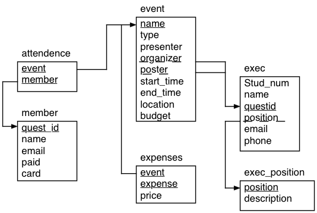

<head>

<script type="text/javascript"
  src="http://cdn.mathjax.org/mathjax/latest/MathJax.js?config=TeX-AMS-
MML_HTMLorMML">
</script>

</head>
<style>

@font-face {
    font-family: "Computer Modern";
    src: url('http://mirrors.ctan.org/fonts/cm-unicode/fonts/otf/cmunss.otf');
}
#notebook_panel { /* main background */
    background: #888;
    color: #f6f6f6;
}
#notebook li { /* More space between bullet points */
margin-top:0.8em;
}
div.text_cell_render{
    font-family: 'Arvo' sans-serif;
    line-height: 130%;
    font-size: 135%;
    width:1000px;
    margin-left:auto;
    margin-right:auto;
}

</style>


<center>

<p class="gap05"<p>
<h1>Intro to SQL:</h1>
<h2>Aggegation, Joins, Subqueries, Set Operations, ...</h2>

<p class="gap05"<p>
<h3>Darrell Aucoin</h3>

<h3>Stats Club</h3>

<p class="gap2"<p>

</center>

<style type="text/css">
.input_prompt, .input_area, .output_prompt {
    display:none !important;
}
</style>
Source for picture: XKCD (Randall Munroe) http://xkcd.com/327/

## Content (This Presentation)

1. Aggregation (GROUP BY)
2. Joining tables
3. Subqueries
4. Set Operations
5. WITH Clause (Increases Readiablity)
6. CASE expressions
7. ORDER BY Clause
8. LIMIT Clause

# How to Follow Along

#### Get the material  

1. Go to https://github.com/NormallySane/IntroSQL
2. Download [zip
file](https://github.com/NormallySane/IntroSQL/archive/master.zip)
    
3. Unzip downloaded file in your preferred directory

#### Using SQLite Browser

1. Open SQLite browser
2. Open `stats_club.db` database file in the downloaded directory
3. Click on 'Execute SQL' tab
    1. Open SQL file `IntroSQL.sql` file in the downloaded directory
    2. Follow along with file, executing statement as topics dictate
4. Content of the talk is on https://github.com/NormallySane/IntroSQL/wiki (open
in your favorite browser)


- SQLite browser is a great tool for learning SQLite and SQL in general

## GROUP BY Clause

- GROUP BY clause groups the table by a column (or tuple of columns) and applies
a function to each group
    - In the SELECT portion of the statement, you can only list the grouped
column(s) and aggregate functions on them.
<center>

</center>

```
SELECT col1, col2, ..., aggregate_function
FROM table_name
GROUP BY col1, col2, ...;
```

### Aggregate Functions

Recall:
__Aggregate Functions:__ Takes in the columns of a table and aggregates over the
entries.
- If we use a GROUP BY clause, the aggregation will be over those groups

| Function | Return value |
|----------|--------------|
| AVG(column) | Average of non-null values |
| COUNT(column) | Count of non-null values |
| MAX(column) | Maximum of values |
| MIN(column) | Minimum of values |
| SUM(column) | Sum of values |
| GROUP_CONCAT(column) | Concatenation of column strings |

- There are more aggregate functions for other implementations of SQL

__Example:__ What are the number of each type of event for Stats Club?

```
SELECT type, COUNT(*) AS num_events
FROM event
GROUP BY type;
```


    import pandas as pd
    import sqlite3 as sql
    con = sql.connect('stats_club.db')


    pd.read_sql_query(
    "SELECT type, COUNT(*) AS num_events \
    FROM event \
    GROUP BY type", con)


<div style="max-height:1000px;max-width:1500px;overflow:auto;">
<table border="1" class="dataframe">
  <thead>
    <tr style="text-align: right;">
      <th></th>
      <th>type</th>
      <th>num_events</th>
    </tr>
  </thead>
  <tbody>
    <tr>
      <th>0</th>
      <td> educational</td>
      <td> 7</td>
    </tr>
    <tr>
      <th>1</th>
      <td>      social</td>
      <td> 2</td>
    </tr>
  </tbody>
</table>
</div>


### HAVING Clause

HAVING clauses are very similar to WHERE clauses but can have aggregate function
in their conditions.

You can have a WHERE and HAVING clause in the same statement.

__Example:__ How many Stats Club members are in each major where the major has
at least 2 members?

```
SELECT faculty, major, COUNT(*)
FROM member
GROUP BY faculty, major
HAVING COUNT(*) >= 2;
```


    pd.read_sql_query(
    "SELECT faculty, major, COUNT(*) \
    FROM member \
    GROUP BY faculty, major \
    HAVING COUNT(*) >= 2", con)


<div style="max-height:1000px;max-width:1500px;overflow:auto;">
<table border="1" class="dataframe">
  <thead>
    <tr style="text-align: right;">
      <th></th>
      <th>faculty</th>
      <th>major</th>
      <th>COUNT(*)</th>
    </tr>
  </thead>
  <tbody>
    <tr>
      <th>0</th>
      <td> Math</td>
      <td>      Act Sci</td>
      <td> 10</td>
    </tr>
    <tr>
      <th>1</th>
      <td> Math</td>
      <td> Applied Math</td>
      <td>  2</td>
    </tr>
    <tr>
      <th>2</th>
      <td> Math</td>
      <td>        C &amp; O</td>
      <td>  2</td>
    </tr>
    <tr>
      <th>3</th>
      <td> Math</td>
      <td>           CS</td>
      <td>  3</td>
    </tr>
    <tr>
      <th>4</th>
      <td> Math</td>
      <td>    Pure Math</td>
      <td>  2</td>
    </tr>
    <tr>
      <th>5</th>
      <td> Math</td>
      <td>        Stats</td>
      <td> 14</td>
    </tr>
  </tbody>
</table>
</div>


### GROUP BY with ROLLUP / CUBE

The ROLLUP operator produces a result set where the aggregate function is
applied to each level of the GROUP BY hierachy.
- The ROLLUP operator is __NOT__ implemented in SQLite
- Useful for making reports with totals and subtotals

```
SELECT col1, col2, ..., aggregate_function
FROM table_name
GROUP BY col1, col2, ... WITH ROLLUP;
```

__Example:__ What are the number of Stats Club members in each faculty and
major, including subtotals?

```
SELECT faculty, major, COUNT(*) AS num_members
FROM member
GROUP BY faculty, major WITH ROLLUP;
```


    pd.read_sql_query(
    "SELECT faculty, major, num_members FROM (  \
    SELECT '1' orderCol, faculty, major, COUNT(*) AS num_members FROM member GROUP BY faculty, major \
    UNION \
    SELECT '2' orderCol, faculty, NULL as major, COUNT(*) AS num_members FROM member \
    GROUP BY faculty \
    UNION \
    SELECT '99' orderCol, NULL AS faculty, NULL AS major, COUNT(*) AS num_members FROM member) AS t1 \
    ORDER BY CASE when orderCol='99' then 1 else 0 end, faculty, orderCol", con)


<div style="max-height:1000px;max-width:1500px;overflow:auto;">
<table border="1" class="dataframe">
  <thead>
    <tr style="text-align: right;">
      <th></th>
      <th>faculty</th>
      <th>major</th>
      <th>num_members</th>
    </tr>
  </thead>
  <tbody>
    <tr>
      <th>0</th>
      <td>  Art</td>
      <td>         Econ</td>
      <td>  1</td>
    </tr>
    <tr>
      <th>1</th>
      <td>  Art</td>
      <td>         None</td>
      <td>  1</td>
    </tr>
    <tr>
      <th>2</th>
      <td> Math</td>
      <td>      Act Sci</td>
      <td> 10</td>
    </tr>
    <tr>
      <th>3</th>
      <td> Math</td>
      <td> Applied Math</td>
      <td>  2</td>
    </tr>
    <tr>
      <th>4</th>
      <td> Math</td>
      <td>        C &amp; O</td>
      <td>  2</td>
    </tr>
    <tr>
      <th>5</th>
      <td> Math</td>
      <td>           CS</td>
      <td>  3</td>
    </tr>
    <tr>
      <th>6</th>
      <td> Math</td>
      <td>    Pure Math</td>
      <td>  2</td>
    </tr>
    <tr>
      <th>7</th>
      <td> Math</td>
      <td>        Stats</td>
      <td> 14</td>
    </tr>
    <tr>
      <th>8</th>
      <td> Math</td>
      <td>         None</td>
      <td> 33</td>
    </tr>
    <tr>
      <th>9</th>
      <td> None</td>
      <td>         None</td>
      <td> 34</td>
    </tr>
  </tbody>
</table>
</div>


Note that for Art and Math in faculty there is a row which has a NULL value.
This is a total for those groups.

There is also one row with NULL values for faculty and major, this is the grand
total of all members.

### Quiz: Aggregation (GROUP BY Clause)

__Q:__ What is the attendance for each Stats Club event?

```
SELECT event, COUNT(*) AS attendance
FROM attendance
GROUP BY event;
```


    pd.read_sql_query(
    "SELECT event, COUNT(*) AS attendance \
    FROM attendance \
    GROUP BY event", con)


<div style="max-height:1000px;max-width:1500px;overflow:auto;">
<table border="1" class="dataframe">
  <thead>
    <tr style="text-align: right;">
      <th></th>
      <th>event</th>
      <th>attendance</th>
    </tr>
  </thead>
  <tbody>
    <tr>
      <th>0</th>
      <td>                            BOT</td>
      <td> 12</td>
    </tr>
    <tr>
      <th>1</th>
      <td>                            EOT</td>
      <td> 18</td>
    </tr>
    <tr>
      <th>2</th>
      <td>                Intro to Hadoop</td>
      <td> 17</td>
    </tr>
    <tr>
      <th>3</th>
      <td>                   Intro to SQL</td>
      <td> 22</td>
    </tr>
    <tr>
      <th>4</th>
      <td> Intro to SQL: Advanced Queries</td>
      <td> 23</td>
    </tr>
    <tr>
      <th>5</th>
      <td>    Intro to SQL: Basic Queries</td>
      <td> 23</td>
    </tr>
    <tr>
      <th>6</th>
      <td>                      Prof Talk</td>
      <td> 20</td>
    </tr>
    <tr>
      <th>7</th>
      <td>                    Prof Talk 2</td>
      <td> 16</td>
    </tr>
  </tbody>
</table>
</div>


## Joins

At times, we need information from multiple tables, to do this we need to join
tables together. We can do this several ways:

1. __CROSS JOIN:__ The cartesian product of rows from each table.
2. __INNER JOIN:__ Join two tables on a join-predicate, losing rows when
evaluated false/null.
3. __OUTER JOIN:__ Retains each record for the table(s) even when it has no
matching rows from the other table. The returning table has null values for
missing records.

    1. __LEFT OUTER JOIN:__ Keep each record for first table but not the table
it's joining with.

    2. __RIGHT OUTER JOIN:__ Keep each record for second table but not the table
it's joining with.

    3. __FULL OUTER JOIN:__ Keep all record for all tables.

4. __NATURAL JOIN:__ Tables with the exact same column name and datatype are
joined along that column.

### CROSS JOIN

__CROSS JOIN__ is the cartesian product of two tables
```
SELECT col1, col2, ...
FROM table1 CROSS JOIN table2;
```
- if table1 has n rows and table2 has m rows, then the result set has n * m rows

We can also get a CROSS JOIN by listing the tables seperated by a ','
```
SELECT col1, col2, ...
FROM table1, table2;
```

__Example:__ Suppose we are creating a games tourtament between Stats Club
members where every member play every other member once. How can we create such
a table?

```
SELECT m1.name AS Player_1, m2.name  AS Player_2
FROM member AS m1 CROSS JOIN member AS m2;
```


    pd.read_sql_query(
    "SELECT m1.name AS Player_1, m2.name  AS Player_2 \
    FROM member AS m1 CROSS JOIN member AS m2", con)


<div style="max-height:1000px;max-width:1500px;overflow:auto;">
<table border="1" class="dataframe">
  <thead>
    <tr style="text-align: right;">
      <th></th>
      <th>Player_1</th>
      <th>Player_2</th>
    </tr>
  </thead>
  <tbody>
    <tr>
      <th>0   </th>
      <td>    Darrell Aucoin</td>
      <td>        Darrell Aucoin</td>
    </tr>
    <tr>
      <th>1   </th>
      <td>    Darrell Aucoin</td>
      <td>         Fred E. Finch</td>
    </tr>
    <tr>
      <th>2   </th>
      <td>    Darrell Aucoin</td>
      <td>          Ryan T. Luby</td>
    </tr>
    <tr>
      <th>3   </th>
      <td>    Darrell Aucoin</td>
      <td>       Billy L. Hunter</td>
    </tr>
    <tr>
      <th>4   </th>
      <td>    Darrell Aucoin</td>
      <td>       John J. Oquendo</td>
    </tr>
    <tr>
      <th>5   </th>
      <td>    Darrell Aucoin</td>
      <td> Stephanie R. Matthews</td>
    </tr>
    <tr>
      <th>6   </th>
      <td>    Darrell Aucoin</td>
      <td>    Robert B. Williams</td>
    </tr>
    <tr>
      <th>7   </th>
      <td>    Darrell Aucoin</td>
      <td>    Austin K. Gilliard</td>
    </tr>
    <tr>
      <th>8   </th>
      <td>    Darrell Aucoin</td>
      <td>      James M. Eddings</td>
    </tr>
    <tr>
      <th>9   </th>
      <td>    Darrell Aucoin</td>
      <td>         Elaine S. Ott</td>
    </tr>
    <tr>
      <th>10  </th>
      <td>    Darrell Aucoin</td>
      <td>         James A. Foxt</td>
    </tr>
    <tr>
      <th>11  </th>
      <td>    Darrell Aucoin</td>
      <td>       Daniel J. Moore</td>
    </tr>
    <tr>
      <th>12  </th>
      <td>    Darrell Aucoin</td>
      <td>     Kelly S. Ferguson</td>
    </tr>
    <tr>
      <th>13  </th>
      <td>    Darrell Aucoin</td>
      <td>        Joseph L. Wood</td>
    </tr>
    <tr>
      <th>14  </th>
      <td>    Darrell Aucoin</td>
      <td>      Vivian R. Donley</td>
    </tr>
    <tr>
      <th>15  </th>
      <td>    Darrell Aucoin</td>
      <td>     Frances A. Miller</td>
    </tr>
    <tr>
      <th>16  </th>
      <td>    Darrell Aucoin</td>
      <td>      Mina W. Lawrence</td>
    </tr>
    <tr>
      <th>17  </th>
      <td>    Darrell Aucoin</td>
      <td> Phillip C. Mascarenas</td>
    </tr>
    <tr>
      <th>18  </th>
      <td>    Darrell Aucoin</td>
      <td>        Jeff M. Wright</td>
    </tr>
    <tr>
      <th>19  </th>
      <td>    Darrell Aucoin</td>
      <td>   Deborah D. Helfrich</td>
    </tr>
    <tr>
      <th>20  </th>
      <td>    Darrell Aucoin</td>
      <td>      Nancy P. Jackson</td>
    </tr>
    <tr>
      <th>21  </th>
      <td>    Darrell Aucoin</td>
      <td>     Bobbie D. Mathews</td>
    </tr>
    <tr>
      <th>22  </th>
      <td>    Darrell Aucoin</td>
      <td>      Arnold J. Fuller</td>
    </tr>
    <tr>
      <th>23  </th>
      <td>    Darrell Aucoin</td>
      <td>      Melvin O. Martin</td>
    </tr>
    <tr>
      <th>24  </th>
      <td>    Darrell Aucoin</td>
      <td>      Ralph L. Waldrop</td>
    </tr>
    <tr>
      <th>25  </th>
      <td>    Darrell Aucoin</td>
      <td>  Mildred F. Hottinger</td>
    </tr>
    <tr>
      <th>26  </th>
      <td>    Darrell Aucoin</td>
      <td>   Tameika M. McMaster</td>
    </tr>
    <tr>
      <th>27  </th>
      <td>    Darrell Aucoin</td>
      <td>   Melissa R. Anderson</td>
    </tr>
    <tr>
      <th>28  </th>
      <td>    Darrell Aucoin</td>
      <td>      Janelle T. Smith</td>
    </tr>
    <tr>
      <th>29  </th>
      <td>    Darrell Aucoin</td>
      <td>     Ann W. McLaughlin</td>
    </tr>
    <tr>
      <th>...</th>
      <td>...</td>
      <td>...</td>
    </tr>
    <tr>
      <th>1126</th>
      <td> Patrick Robertson</td>
      <td>       John J. Oquendo</td>
    </tr>
    <tr>
      <th>1127</th>
      <td> Patrick Robertson</td>
      <td> Stephanie R. Matthews</td>
    </tr>
    <tr>
      <th>1128</th>
      <td> Patrick Robertson</td>
      <td>    Robert B. Williams</td>
    </tr>
    <tr>
      <th>1129</th>
      <td> Patrick Robertson</td>
      <td>    Austin K. Gilliard</td>
    </tr>
    <tr>
      <th>1130</th>
      <td> Patrick Robertson</td>
      <td>      James M. Eddings</td>
    </tr>
    <tr>
      <th>1131</th>
      <td> Patrick Robertson</td>
      <td>         Elaine S. Ott</td>
    </tr>
    <tr>
      <th>1132</th>
      <td> Patrick Robertson</td>
      <td>         James A. Foxt</td>
    </tr>
    <tr>
      <th>1133</th>
      <td> Patrick Robertson</td>
      <td>       Daniel J. Moore</td>
    </tr>
    <tr>
      <th>1134</th>
      <td> Patrick Robertson</td>
      <td>     Kelly S. Ferguson</td>
    </tr>
    <tr>
      <th>1135</th>
      <td> Patrick Robertson</td>
      <td>        Joseph L. Wood</td>
    </tr>
    <tr>
      <th>1136</th>
      <td> Patrick Robertson</td>
      <td>      Vivian R. Donley</td>
    </tr>
    <tr>
      <th>1137</th>
      <td> Patrick Robertson</td>
      <td>     Frances A. Miller</td>
    </tr>
    <tr>
      <th>1138</th>
      <td> Patrick Robertson</td>
      <td>      Mina W. Lawrence</td>
    </tr>
    <tr>
      <th>1139</th>
      <td> Patrick Robertson</td>
      <td> Phillip C. Mascarenas</td>
    </tr>
    <tr>
      <th>1140</th>
      <td> Patrick Robertson</td>
      <td>        Jeff M. Wright</td>
    </tr>
    <tr>
      <th>1141</th>
      <td> Patrick Robertson</td>
      <td>   Deborah D. Helfrich</td>
    </tr>
    <tr>
      <th>1142</th>
      <td> Patrick Robertson</td>
      <td>      Nancy P. Jackson</td>
    </tr>
    <tr>
      <th>1143</th>
      <td> Patrick Robertson</td>
      <td>     Bobbie D. Mathews</td>
    </tr>
    <tr>
      <th>1144</th>
      <td> Patrick Robertson</td>
      <td>      Arnold J. Fuller</td>
    </tr>
    <tr>
      <th>1145</th>
      <td> Patrick Robertson</td>
      <td>      Melvin O. Martin</td>
    </tr>
    <tr>
      <th>1146</th>
      <td> Patrick Robertson</td>
      <td>      Ralph L. Waldrop</td>
    </tr>
    <tr>
      <th>1147</th>
      <td> Patrick Robertson</td>
      <td>  Mildred F. Hottinger</td>
    </tr>
    <tr>
      <th>1148</th>
      <td> Patrick Robertson</td>
      <td>   Tameika M. McMaster</td>
    </tr>
    <tr>
      <th>1149</th>
      <td> Patrick Robertson</td>
      <td>   Melissa R. Anderson</td>
    </tr>
    <tr>
      <th>1150</th>
      <td> Patrick Robertson</td>
      <td>      Janelle T. Smith</td>
    </tr>
    <tr>
      <th>1151</th>
      <td> Patrick Robertson</td>
      <td>     Ann W. McLaughlin</td>
    </tr>
    <tr>
      <th>1152</th>
      <td> Patrick Robertson</td>
      <td>     Judith B. Gibbons</td>
    </tr>
    <tr>
      <th>1153</th>
      <td> Patrick Robertson</td>
      <td>            Ruben Lamb</td>
    </tr>
    <tr>
      <th>1154</th>
      <td> Patrick Robertson</td>
      <td>         Dominick Byrd</td>
    </tr>
    <tr>
      <th>1155</th>
      <td> Patrick Robertson</td>
      <td>     Patrick Robertson</td>
    </tr>
  </tbody>
</table>
<p>1156 rows × 2 columns</p>
</div>


However we have have players playing themselves, and rounds with  the same
players in opposite roles. We just need to filter these out.
```
SELECT m1.name AS Player_1, m2.name  AS Player_2
FROM member AS m1 CROSS JOIN member AS m2
WHERE m1.name > m2.name;
```


    pd.read_sql_query(
    "SELECT m1.name AS Player_1, m2.name  AS Player_2 \
    FROM member AS m1 CROSS JOIN member AS m2 \
    WHERE m1.name > m2.name", con)


<div style="max-height:1000px;max-width:1500px;overflow:auto;">
<table border="1" class="dataframe">
  <thead>
    <tr style="text-align: right;">
      <th></th>
      <th>Player_1</th>
      <th>Player_2</th>
    </tr>
  </thead>
  <tbody>
    <tr>
      <th>0  </th>
      <td>    Darrell Aucoin</td>
      <td>      Billy L. Hunter</td>
    </tr>
    <tr>
      <th>1  </th>
      <td>    Darrell Aucoin</td>
      <td>   Austin K. Gilliard</td>
    </tr>
    <tr>
      <th>2  </th>
      <td>    Darrell Aucoin</td>
      <td>      Daniel J. Moore</td>
    </tr>
    <tr>
      <th>3  </th>
      <td>    Darrell Aucoin</td>
      <td>    Bobbie D. Mathews</td>
    </tr>
    <tr>
      <th>4  </th>
      <td>    Darrell Aucoin</td>
      <td>     Arnold J. Fuller</td>
    </tr>
    <tr>
      <th>5  </th>
      <td>    Darrell Aucoin</td>
      <td>    Ann W. McLaughlin</td>
    </tr>
    <tr>
      <th>6  </th>
      <td>     Fred E. Finch</td>
      <td>       Darrell Aucoin</td>
    </tr>
    <tr>
      <th>7  </th>
      <td>     Fred E. Finch</td>
      <td>      Billy L. Hunter</td>
    </tr>
    <tr>
      <th>8  </th>
      <td>     Fred E. Finch</td>
      <td>   Austin K. Gilliard</td>
    </tr>
    <tr>
      <th>9  </th>
      <td>     Fred E. Finch</td>
      <td>        Elaine S. Ott</td>
    </tr>
    <tr>
      <th>10 </th>
      <td>     Fred E. Finch</td>
      <td>      Daniel J. Moore</td>
    </tr>
    <tr>
      <th>11 </th>
      <td>     Fred E. Finch</td>
      <td>    Frances A. Miller</td>
    </tr>
    <tr>
      <th>12 </th>
      <td>     Fred E. Finch</td>
      <td>  Deborah D. Helfrich</td>
    </tr>
    <tr>
      <th>13 </th>
      <td>     Fred E. Finch</td>
      <td>    Bobbie D. Mathews</td>
    </tr>
    <tr>
      <th>14 </th>
      <td>     Fred E. Finch</td>
      <td>     Arnold J. Fuller</td>
    </tr>
    <tr>
      <th>15 </th>
      <td>     Fred E. Finch</td>
      <td>    Ann W. McLaughlin</td>
    </tr>
    <tr>
      <th>16 </th>
      <td>     Fred E. Finch</td>
      <td>        Dominick Byrd</td>
    </tr>
    <tr>
      <th>17 </th>
      <td>      Ryan T. Luby</td>
      <td>       Darrell Aucoin</td>
    </tr>
    <tr>
      <th>18 </th>
      <td>      Ryan T. Luby</td>
      <td>        Fred E. Finch</td>
    </tr>
    <tr>
      <th>19 </th>
      <td>      Ryan T. Luby</td>
      <td>      Billy L. Hunter</td>
    </tr>
    <tr>
      <th>20 </th>
      <td>      Ryan T. Luby</td>
      <td>      John J. Oquendo</td>
    </tr>
    <tr>
      <th>21 </th>
      <td>      Ryan T. Luby</td>
      <td>   Robert B. Williams</td>
    </tr>
    <tr>
      <th>22 </th>
      <td>      Ryan T. Luby</td>
      <td>   Austin K. Gilliard</td>
    </tr>
    <tr>
      <th>23 </th>
      <td>      Ryan T. Luby</td>
      <td>     James M. Eddings</td>
    </tr>
    <tr>
      <th>24 </th>
      <td>      Ryan T. Luby</td>
      <td>        Elaine S. Ott</td>
    </tr>
    <tr>
      <th>25 </th>
      <td>      Ryan T. Luby</td>
      <td>        James A. Foxt</td>
    </tr>
    <tr>
      <th>26 </th>
      <td>      Ryan T. Luby</td>
      <td>      Daniel J. Moore</td>
    </tr>
    <tr>
      <th>27 </th>
      <td>      Ryan T. Luby</td>
      <td>    Kelly S. Ferguson</td>
    </tr>
    <tr>
      <th>28 </th>
      <td>      Ryan T. Luby</td>
      <td>       Joseph L. Wood</td>
    </tr>
    <tr>
      <th>29 </th>
      <td>      Ryan T. Luby</td>
      <td>    Frances A. Miller</td>
    </tr>
    <tr>
      <th>...</th>
      <td>...</td>
      <td>...</td>
    </tr>
    <tr>
      <th>531</th>
      <td>     Dominick Byrd</td>
      <td>      Daniel J. Moore</td>
    </tr>
    <tr>
      <th>532</th>
      <td>     Dominick Byrd</td>
      <td>  Deborah D. Helfrich</td>
    </tr>
    <tr>
      <th>533</th>
      <td>     Dominick Byrd</td>
      <td>    Bobbie D. Mathews</td>
    </tr>
    <tr>
      <th>534</th>
      <td>     Dominick Byrd</td>
      <td>     Arnold J. Fuller</td>
    </tr>
    <tr>
      <th>535</th>
      <td>     Dominick Byrd</td>
      <td>    Ann W. McLaughlin</td>
    </tr>
    <tr>
      <th>536</th>
      <td> Patrick Robertson</td>
      <td>       Darrell Aucoin</td>
    </tr>
    <tr>
      <th>537</th>
      <td> Patrick Robertson</td>
      <td>        Fred E. Finch</td>
    </tr>
    <tr>
      <th>538</th>
      <td> Patrick Robertson</td>
      <td>      Billy L. Hunter</td>
    </tr>
    <tr>
      <th>539</th>
      <td> Patrick Robertson</td>
      <td>      John J. Oquendo</td>
    </tr>
    <tr>
      <th>540</th>
      <td> Patrick Robertson</td>
      <td>   Austin K. Gilliard</td>
    </tr>
    <tr>
      <th>541</th>
      <td> Patrick Robertson</td>
      <td>     James M. Eddings</td>
    </tr>
    <tr>
      <th>542</th>
      <td> Patrick Robertson</td>
      <td>        Elaine S. Ott</td>
    </tr>
    <tr>
      <th>543</th>
      <td> Patrick Robertson</td>
      <td>        James A. Foxt</td>
    </tr>
    <tr>
      <th>544</th>
      <td> Patrick Robertson</td>
      <td>      Daniel J. Moore</td>
    </tr>
    <tr>
      <th>545</th>
      <td> Patrick Robertson</td>
      <td>    Kelly S. Ferguson</td>
    </tr>
    <tr>
      <th>546</th>
      <td> Patrick Robertson</td>
      <td>       Joseph L. Wood</td>
    </tr>
    <tr>
      <th>547</th>
      <td> Patrick Robertson</td>
      <td>    Frances A. Miller</td>
    </tr>
    <tr>
      <th>548</th>
      <td> Patrick Robertson</td>
      <td>     Mina W. Lawrence</td>
    </tr>
    <tr>
      <th>549</th>
      <td> Patrick Robertson</td>
      <td>       Jeff M. Wright</td>
    </tr>
    <tr>
      <th>550</th>
      <td> Patrick Robertson</td>
      <td>  Deborah D. Helfrich</td>
    </tr>
    <tr>
      <th>551</th>
      <td> Patrick Robertson</td>
      <td>     Nancy P. Jackson</td>
    </tr>
    <tr>
      <th>552</th>
      <td> Patrick Robertson</td>
      <td>    Bobbie D. Mathews</td>
    </tr>
    <tr>
      <th>553</th>
      <td> Patrick Robertson</td>
      <td>     Arnold J. Fuller</td>
    </tr>
    <tr>
      <th>554</th>
      <td> Patrick Robertson</td>
      <td>     Melvin O. Martin</td>
    </tr>
    <tr>
      <th>555</th>
      <td> Patrick Robertson</td>
      <td> Mildred F. Hottinger</td>
    </tr>
    <tr>
      <th>556</th>
      <td> Patrick Robertson</td>
      <td>  Melissa R. Anderson</td>
    </tr>
    <tr>
      <th>557</th>
      <td> Patrick Robertson</td>
      <td>     Janelle T. Smith</td>
    </tr>
    <tr>
      <th>558</th>
      <td> Patrick Robertson</td>
      <td>    Ann W. McLaughlin</td>
    </tr>
    <tr>
      <th>559</th>
      <td> Patrick Robertson</td>
      <td>    Judith B. Gibbons</td>
    </tr>
    <tr>
      <th>560</th>
      <td> Patrick Robertson</td>
      <td>        Dominick Byrd</td>
    </tr>
  </tbody>
</table>
<p>561 rows × 2 columns</p>
</div>


### INNER JOIN

__INNER JOIN__ Joins two tables where the join condition returns true. Discarded
when returning false or NULL.
```
SELECT col1, col2, ...
FROM table1 INNER JOIN table2 ON condition;
```

#### ON Clause

The __ON__ clause specifies the join condition:

- The ON clause can use a multiple set of conditions connected by AND, OR

- USING(<join col>) can also be used if both tables have the same column name
and type

- Some SQL implementations constructs the ON clause from the WHERE clause (DB2)
    - filtering by the WHERE clause gives the same result but in some
implementations will product an intermediate cross product of tables (making the
query slower)

__Example:__ Note that in the previous example with CROSS JOIN where we made a
tournament player list using the WHERE clause, we can get the same table by
using an INNER JOIN and Θ='>'.

```
SELECT m1.name AS Player_1, m2.name  AS Player_2
FROM member AS m1 INNER JOIN member AS m2 ON m1.name > m2.name;
```


    pd.read_sql_query(
    "SELECT m1.name AS Player_1, m2.name  AS Player_2 \
    FROM member AS m1 INNER JOIN member AS m2 ON m1.name > m2.name", con)


<div style="max-height:1000px;max-width:1500px;overflow:auto;">
<table border="1" class="dataframe">
  <thead>
    <tr style="text-align: right;">
      <th></th>
      <th>Player_1</th>
      <th>Player_2</th>
    </tr>
  </thead>
  <tbody>
    <tr>
      <th>0  </th>
      <td>    Darrell Aucoin</td>
      <td>      Billy L. Hunter</td>
    </tr>
    <tr>
      <th>1  </th>
      <td>    Darrell Aucoin</td>
      <td>   Austin K. Gilliard</td>
    </tr>
    <tr>
      <th>2  </th>
      <td>    Darrell Aucoin</td>
      <td>      Daniel J. Moore</td>
    </tr>
    <tr>
      <th>3  </th>
      <td>    Darrell Aucoin</td>
      <td>    Bobbie D. Mathews</td>
    </tr>
    <tr>
      <th>4  </th>
      <td>    Darrell Aucoin</td>
      <td>     Arnold J. Fuller</td>
    </tr>
    <tr>
      <th>5  </th>
      <td>    Darrell Aucoin</td>
      <td>    Ann W. McLaughlin</td>
    </tr>
    <tr>
      <th>6  </th>
      <td>     Fred E. Finch</td>
      <td>       Darrell Aucoin</td>
    </tr>
    <tr>
      <th>7  </th>
      <td>     Fred E. Finch</td>
      <td>      Billy L. Hunter</td>
    </tr>
    <tr>
      <th>8  </th>
      <td>     Fred E. Finch</td>
      <td>   Austin K. Gilliard</td>
    </tr>
    <tr>
      <th>9  </th>
      <td>     Fred E. Finch</td>
      <td>        Elaine S. Ott</td>
    </tr>
    <tr>
      <th>10 </th>
      <td>     Fred E. Finch</td>
      <td>      Daniel J. Moore</td>
    </tr>
    <tr>
      <th>11 </th>
      <td>     Fred E. Finch</td>
      <td>    Frances A. Miller</td>
    </tr>
    <tr>
      <th>12 </th>
      <td>     Fred E. Finch</td>
      <td>  Deborah D. Helfrich</td>
    </tr>
    <tr>
      <th>13 </th>
      <td>     Fred E. Finch</td>
      <td>    Bobbie D. Mathews</td>
    </tr>
    <tr>
      <th>14 </th>
      <td>     Fred E. Finch</td>
      <td>     Arnold J. Fuller</td>
    </tr>
    <tr>
      <th>15 </th>
      <td>     Fred E. Finch</td>
      <td>    Ann W. McLaughlin</td>
    </tr>
    <tr>
      <th>16 </th>
      <td>     Fred E. Finch</td>
      <td>        Dominick Byrd</td>
    </tr>
    <tr>
      <th>17 </th>
      <td>      Ryan T. Luby</td>
      <td>       Darrell Aucoin</td>
    </tr>
    <tr>
      <th>18 </th>
      <td>      Ryan T. Luby</td>
      <td>        Fred E. Finch</td>
    </tr>
    <tr>
      <th>19 </th>
      <td>      Ryan T. Luby</td>
      <td>      Billy L. Hunter</td>
    </tr>
    <tr>
      <th>20 </th>
      <td>      Ryan T. Luby</td>
      <td>      John J. Oquendo</td>
    </tr>
    <tr>
      <th>21 </th>
      <td>      Ryan T. Luby</td>
      <td>   Robert B. Williams</td>
    </tr>
    <tr>
      <th>22 </th>
      <td>      Ryan T. Luby</td>
      <td>   Austin K. Gilliard</td>
    </tr>
    <tr>
      <th>23 </th>
      <td>      Ryan T. Luby</td>
      <td>     James M. Eddings</td>
    </tr>
    <tr>
      <th>24 </th>
      <td>      Ryan T. Luby</td>
      <td>        Elaine S. Ott</td>
    </tr>
    <tr>
      <th>25 </th>
      <td>      Ryan T. Luby</td>
      <td>        James A. Foxt</td>
    </tr>
    <tr>
      <th>26 </th>
      <td>      Ryan T. Luby</td>
      <td>      Daniel J. Moore</td>
    </tr>
    <tr>
      <th>27 </th>
      <td>      Ryan T. Luby</td>
      <td>    Kelly S. Ferguson</td>
    </tr>
    <tr>
      <th>28 </th>
      <td>      Ryan T. Luby</td>
      <td>       Joseph L. Wood</td>
    </tr>
    <tr>
      <th>29 </th>
      <td>      Ryan T. Luby</td>
      <td>    Frances A. Miller</td>
    </tr>
    <tr>
      <th>...</th>
      <td>...</td>
      <td>...</td>
    </tr>
    <tr>
      <th>531</th>
      <td>     Dominick Byrd</td>
      <td>      Daniel J. Moore</td>
    </tr>
    <tr>
      <th>532</th>
      <td>     Dominick Byrd</td>
      <td>  Deborah D. Helfrich</td>
    </tr>
    <tr>
      <th>533</th>
      <td>     Dominick Byrd</td>
      <td>    Bobbie D. Mathews</td>
    </tr>
    <tr>
      <th>534</th>
      <td>     Dominick Byrd</td>
      <td>     Arnold J. Fuller</td>
    </tr>
    <tr>
      <th>535</th>
      <td>     Dominick Byrd</td>
      <td>    Ann W. McLaughlin</td>
    </tr>
    <tr>
      <th>536</th>
      <td> Patrick Robertson</td>
      <td>       Darrell Aucoin</td>
    </tr>
    <tr>
      <th>537</th>
      <td> Patrick Robertson</td>
      <td>        Fred E. Finch</td>
    </tr>
    <tr>
      <th>538</th>
      <td> Patrick Robertson</td>
      <td>      Billy L. Hunter</td>
    </tr>
    <tr>
      <th>539</th>
      <td> Patrick Robertson</td>
      <td>      John J. Oquendo</td>
    </tr>
    <tr>
      <th>540</th>
      <td> Patrick Robertson</td>
      <td>   Austin K. Gilliard</td>
    </tr>
    <tr>
      <th>541</th>
      <td> Patrick Robertson</td>
      <td>     James M. Eddings</td>
    </tr>
    <tr>
      <th>542</th>
      <td> Patrick Robertson</td>
      <td>        Elaine S. Ott</td>
    </tr>
    <tr>
      <th>543</th>
      <td> Patrick Robertson</td>
      <td>        James A. Foxt</td>
    </tr>
    <tr>
      <th>544</th>
      <td> Patrick Robertson</td>
      <td>      Daniel J. Moore</td>
    </tr>
    <tr>
      <th>545</th>
      <td> Patrick Robertson</td>
      <td>    Kelly S. Ferguson</td>
    </tr>
    <tr>
      <th>546</th>
      <td> Patrick Robertson</td>
      <td>       Joseph L. Wood</td>
    </tr>
    <tr>
      <th>547</th>
      <td> Patrick Robertson</td>
      <td>    Frances A. Miller</td>
    </tr>
    <tr>
      <th>548</th>
      <td> Patrick Robertson</td>
      <td>     Mina W. Lawrence</td>
    </tr>
    <tr>
      <th>549</th>
      <td> Patrick Robertson</td>
      <td>       Jeff M. Wright</td>
    </tr>
    <tr>
      <th>550</th>
      <td> Patrick Robertson</td>
      <td>  Deborah D. Helfrich</td>
    </tr>
    <tr>
      <th>551</th>
      <td> Patrick Robertson</td>
      <td>     Nancy P. Jackson</td>
    </tr>
    <tr>
      <th>552</th>
      <td> Patrick Robertson</td>
      <td>    Bobbie D. Mathews</td>
    </tr>
    <tr>
      <th>553</th>
      <td> Patrick Robertson</td>
      <td>     Arnold J. Fuller</td>
    </tr>
    <tr>
      <th>554</th>
      <td> Patrick Robertson</td>
      <td>     Melvin O. Martin</td>
    </tr>
    <tr>
      <th>555</th>
      <td> Patrick Robertson</td>
      <td> Mildred F. Hottinger</td>
    </tr>
    <tr>
      <th>556</th>
      <td> Patrick Robertson</td>
      <td>  Melissa R. Anderson</td>
    </tr>
    <tr>
      <th>557</th>
      <td> Patrick Robertson</td>
      <td>     Janelle T. Smith</td>
    </tr>
    <tr>
      <th>558</th>
      <td> Patrick Robertson</td>
      <td>    Ann W. McLaughlin</td>
    </tr>
    <tr>
      <th>559</th>
      <td> Patrick Robertson</td>
      <td>    Judith B. Gibbons</td>
    </tr>
    <tr>
      <th>560</th>
      <td> Patrick Robertson</td>
      <td>        Dominick Byrd</td>
    </tr>
  </tbody>
</table>
<p>561 rows × 2 columns</p>
</div>


__Note:__ `CROSS JOIN` is rarely used in practice as `INNER JOIN` is more
efficient and usually the same `WHERE` condition can be applied to the ON
clause.

__Example:__ How many events does each member attend?

- Note that this query does not include members who attended no events
    - Query is ordered by events_attended to show a comparison with a latter
query

```
SELECT m.name, COUNT(a.event) AS events_attended
FROM member AS m INNER JOIN attendance AS a ON m.quest_id = a.member
GROUP BY m.name
ORDER BY events_attended;
```


    pd.read_sql_query(
    "SELECT m.name, COUNT(a.event) AS events_attended \
    FROM member AS m INNER JOIN attendance AS a ON m.quest_id = a.member \
    GROUP BY m.name \
    ORDER BY events_attended", con)


<div style="max-height:1000px;max-width:1500px;overflow:auto;">
<table border="1" class="dataframe">
  <thead>
    <tr style="text-align: right;">
      <th></th>
      <th>name</th>
      <th>events_attended</th>
    </tr>
  </thead>
  <tbody>
    <tr>
      <th>0 </th>
      <td>       John J. Oquendo</td>
      <td> 1</td>
    </tr>
    <tr>
      <th>1 </th>
      <td>   Melissa R. Anderson</td>
      <td> 2</td>
    </tr>
    <tr>
      <th>2 </th>
      <td>      Melvin O. Martin</td>
      <td> 2</td>
    </tr>
    <tr>
      <th>3 </th>
      <td>      Mina W. Lawrence</td>
      <td> 2</td>
    </tr>
    <tr>
      <th>4 </th>
      <td>     Ann W. McLaughlin</td>
      <td> 3</td>
    </tr>
    <tr>
      <th>5 </th>
      <td>     Bobbie D. Mathews</td>
      <td> 3</td>
    </tr>
    <tr>
      <th>6 </th>
      <td>      James M. Eddings</td>
      <td> 3</td>
    </tr>
    <tr>
      <th>7 </th>
      <td>    Austin K. Gilliard</td>
      <td> 4</td>
    </tr>
    <tr>
      <th>8 </th>
      <td>      Janelle T. Smith</td>
      <td> 4</td>
    </tr>
    <tr>
      <th>9 </th>
      <td>        Jeff M. Wright</td>
      <td> 4</td>
    </tr>
    <tr>
      <th>10</th>
      <td>  Mildred F. Hottinger</td>
      <td> 4</td>
    </tr>
    <tr>
      <th>11</th>
      <td> Phillip C. Mascarenas</td>
      <td> 4</td>
    </tr>
    <tr>
      <th>12</th>
      <td>          Ryan T. Luby</td>
      <td> 4</td>
    </tr>
    <tr>
      <th>13</th>
      <td>      Vivian R. Donley</td>
      <td> 4</td>
    </tr>
    <tr>
      <th>14</th>
      <td>      Arnold J. Fuller</td>
      <td> 5</td>
    </tr>
    <tr>
      <th>15</th>
      <td>         Dominick Byrd</td>
      <td> 5</td>
    </tr>
    <tr>
      <th>16</th>
      <td>     Kelly S. Ferguson</td>
      <td> 5</td>
    </tr>
    <tr>
      <th>17</th>
      <td>      Nancy P. Jackson</td>
      <td> 5</td>
    </tr>
    <tr>
      <th>18</th>
      <td>      Ralph L. Waldrop</td>
      <td> 5</td>
    </tr>
    <tr>
      <th>19</th>
      <td>            Ruben Lamb</td>
      <td> 5</td>
    </tr>
    <tr>
      <th>20</th>
      <td>       Billy L. Hunter</td>
      <td> 6</td>
    </tr>
    <tr>
      <th>21</th>
      <td>   Deborah D. Helfrich</td>
      <td> 6</td>
    </tr>
    <tr>
      <th>22</th>
      <td>     Frances A. Miller</td>
      <td> 6</td>
    </tr>
    <tr>
      <th>23</th>
      <td>         Fred E. Finch</td>
      <td> 6</td>
    </tr>
    <tr>
      <th>24</th>
      <td>        Joseph L. Wood</td>
      <td> 6</td>
    </tr>
    <tr>
      <th>25</th>
      <td>     Judith B. Gibbons</td>
      <td> 6</td>
    </tr>
    <tr>
      <th>26</th>
      <td>    Robert B. Williams</td>
      <td> 6</td>
    </tr>
    <tr>
      <th>27</th>
      <td> Stephanie R. Matthews</td>
      <td> 6</td>
    </tr>
    <tr>
      <th>28</th>
      <td>   Tameika M. McMaster</td>
      <td> 6</td>
    </tr>
    <tr>
      <th>29</th>
      <td>         Elaine S. Ott</td>
      <td> 7</td>
    </tr>
    <tr>
      <th>30</th>
      <td>       Daniel J. Moore</td>
      <td> 8</td>
    </tr>
    <tr>
      <th>31</th>
      <td>     Patrick Robertson</td>
      <td> 8</td>
    </tr>
  </tbody>
</table>
</div>


### OUTER JOIN

__OUTER JOIN__ A join that returns all rows for 1 or 2 tables, even when there
is no corresponding value. In these cases, NULL values are entered for these
corresponding rows.

There are 3 types of OUTER JOINs:

1. __LEFT OUTER JOIN__: An OUTER JOIN returning all rows of the table first
mentioned.

2. __RIGHT OUTER JOIN__: An OUTER JOIN returning all rows of the table second
mentioned.

3. __FULL OUTER JOIN__: An OUTER JOIN returning all rows of both tables.


- Only LEFT OUTER JOIN is implemented in SQLite

__Example:__ What are the names of Stat Club members and how many events they
attended?

```
SELECT m.name, COUNT(a.event) AS events_attended
FROM member AS m LEFT OUTER JOIN attendance AS a ON m.quest_id = a.member
GROUP BY m.name
ORDER BY events_attended;
```


    pd.read_sql_query(
    "SELECT m.name, COUNT(a.event) AS events_attended \
    FROM member AS m LEFT OUTER JOIN attendance AS a ON m.quest_id = a.member \
    GROUP BY m.name \
    ORDER BY events_attended", con)


<div style="max-height:1000px;max-width:1500px;overflow:auto;">
<table border="1" class="dataframe">
  <thead>
    <tr style="text-align: right;">
      <th></th>
      <th>name</th>
      <th>events_attended</th>
    </tr>
  </thead>
  <tbody>
    <tr>
      <th>0 </th>
      <td>        Darrell Aucoin</td>
      <td> 0</td>
    </tr>
    <tr>
      <th>1 </th>
      <td>         James A. Foxt</td>
      <td> 0</td>
    </tr>
    <tr>
      <th>2 </th>
      <td>       John J. Oquendo</td>
      <td> 1</td>
    </tr>
    <tr>
      <th>3 </th>
      <td>   Melissa R. Anderson</td>
      <td> 2</td>
    </tr>
    <tr>
      <th>4 </th>
      <td>      Melvin O. Martin</td>
      <td> 2</td>
    </tr>
    <tr>
      <th>5 </th>
      <td>      Mina W. Lawrence</td>
      <td> 2</td>
    </tr>
    <tr>
      <th>6 </th>
      <td>     Ann W. McLaughlin</td>
      <td> 3</td>
    </tr>
    <tr>
      <th>7 </th>
      <td>     Bobbie D. Mathews</td>
      <td> 3</td>
    </tr>
    <tr>
      <th>8 </th>
      <td>      James M. Eddings</td>
      <td> 3</td>
    </tr>
    <tr>
      <th>9 </th>
      <td>    Austin K. Gilliard</td>
      <td> 4</td>
    </tr>
    <tr>
      <th>10</th>
      <td>      Janelle T. Smith</td>
      <td> 4</td>
    </tr>
    <tr>
      <th>11</th>
      <td>        Jeff M. Wright</td>
      <td> 4</td>
    </tr>
    <tr>
      <th>12</th>
      <td>  Mildred F. Hottinger</td>
      <td> 4</td>
    </tr>
    <tr>
      <th>13</th>
      <td> Phillip C. Mascarenas</td>
      <td> 4</td>
    </tr>
    <tr>
      <th>14</th>
      <td>          Ryan T. Luby</td>
      <td> 4</td>
    </tr>
    <tr>
      <th>15</th>
      <td>      Vivian R. Donley</td>
      <td> 4</td>
    </tr>
    <tr>
      <th>16</th>
      <td>      Arnold J. Fuller</td>
      <td> 5</td>
    </tr>
    <tr>
      <th>17</th>
      <td>         Dominick Byrd</td>
      <td> 5</td>
    </tr>
    <tr>
      <th>18</th>
      <td>     Kelly S. Ferguson</td>
      <td> 5</td>
    </tr>
    <tr>
      <th>19</th>
      <td>      Nancy P. Jackson</td>
      <td> 5</td>
    </tr>
    <tr>
      <th>20</th>
      <td>      Ralph L. Waldrop</td>
      <td> 5</td>
    </tr>
    <tr>
      <th>21</th>
      <td>            Ruben Lamb</td>
      <td> 5</td>
    </tr>
    <tr>
      <th>22</th>
      <td>       Billy L. Hunter</td>
      <td> 6</td>
    </tr>
    <tr>
      <th>23</th>
      <td>   Deborah D. Helfrich</td>
      <td> 6</td>
    </tr>
    <tr>
      <th>24</th>
      <td>     Frances A. Miller</td>
      <td> 6</td>
    </tr>
    <tr>
      <th>25</th>
      <td>         Fred E. Finch</td>
      <td> 6</td>
    </tr>
    <tr>
      <th>26</th>
      <td>        Joseph L. Wood</td>
      <td> 6</td>
    </tr>
    <tr>
      <th>27</th>
      <td>     Judith B. Gibbons</td>
      <td> 6</td>
    </tr>
    <tr>
      <th>28</th>
      <td>    Robert B. Williams</td>
      <td> 6</td>
    </tr>
    <tr>
      <th>29</th>
      <td> Stephanie R. Matthews</td>
      <td> 6</td>
    </tr>
    <tr>
      <th>30</th>
      <td>   Tameika M. McMaster</td>
      <td> 6</td>
    </tr>
    <tr>
      <th>31</th>
      <td>         Elaine S. Ott</td>
      <td> 7</td>
    </tr>
    <tr>
      <th>32</th>
      <td>       Daniel J. Moore</td>
      <td> 8</td>
    </tr>
    <tr>
      <th>33</th>
      <td>     Patrick Robertson</td>
      <td> 8</td>
    </tr>
  </tbody>
</table>
</div>


### Natural Join

__NATURAL JOIN__ A join condition that lets the server decide on the join
conditions based on the same column names and types across columns for the
tables.

__Example:__ What are the position and duties of each Stats Club exec?

```
SELECT  e.name, e.position, ep.duties
FROM exec AS e NATURAL JOIN exec_position AS ep;
```


    pd.read_sql_query(
    "SELECT  e.name, e.position, ep.duties \
    FROM exec AS e NATURAL JOIN exec_position AS ep", con)


<div style="max-height:1000px;max-width:1500px;overflow:auto;">
<table border="1" class="dataframe">
  <thead>
    <tr style="text-align: right;">
      <th></th>
      <th>name</th>
      <th>position</th>
      <th>duties</th>
    </tr>
  </thead>
  <tbody>
    <tr>
      <th>0 </th>
      <td>    Darrell Aucoin</td>
      <td>  President</td>
      <td> To be aware of MathSoc's Policies and Bylaws i...</td>
    </tr>
    <tr>
      <th>1 </th>
      <td>    Darrell Aucoin</td>
      <td>  President</td>
      <td>        To call and preside over general meetings.</td>
    </tr>
    <tr>
      <th>2 </th>
      <td>    Darrell Aucoin</td>
      <td>  President</td>
      <td> To manage the executive team and the strategic...</td>
    </tr>
    <tr>
      <th>3 </th>
      <td>    Darrell Aucoin</td>
      <td>  President</td>
      <td> To post announcements of all club meetings, an...</td>
    </tr>
    <tr>
      <th>4 </th>
      <td> Judith B. Gibbons</td>
      <td>     Events</td>
      <td> To assist the president and other vice-preside...</td>
    </tr>
    <tr>
      <th>5 </th>
      <td> Judith B. Gibbons</td>
      <td>     Events</td>
      <td> To chair the organization and promotion of lea...</td>
    </tr>
    <tr>
      <th>6 </th>
      <td>         Lamar Roy</td>
      <td>    Finance</td>
      <td> To ensure membership fees are collected and ma...</td>
    </tr>
    <tr>
      <th>7 </th>
      <td>         Lamar Roy</td>
      <td>    Finance</td>
      <td> To keep an up-to-date record of financial tran...</td>
    </tr>
    <tr>
      <th>8 </th>
      <td>         Lamar Roy</td>
      <td>    Finance</td>
      <td> To prepare a summary of the financial records ...</td>
    </tr>
    <tr>
      <th>9 </th>
      <td>         Lamar Roy</td>
      <td>    Finance</td>
      <td>   To prepare the budget at the beginning of term.</td>
    </tr>
    <tr>
      <th>10</th>
      <td>         Lamar Roy</td>
      <td>    Finance</td>
      <td> To volunteer as president in the absence of th...</td>
    </tr>
    <tr>
      <th>11</th>
      <td>    Gilberto Cross</td>
      <td>     Events</td>
      <td> To assist the president and other vice-preside...</td>
    </tr>
    <tr>
      <th>12</th>
      <td>    Gilberto Cross</td>
      <td>     Events</td>
      <td> To chair the organization and promotion of lea...</td>
    </tr>
    <tr>
      <th>13</th>
      <td>        Melba Lane</td>
      <td>  President</td>
      <td> To be aware of MathSoc's Policies and Bylaws i...</td>
    </tr>
    <tr>
      <th>14</th>
      <td>        Melba Lane</td>
      <td>  President</td>
      <td>        To call and preside over general meetings.</td>
    </tr>
    <tr>
      <th>15</th>
      <td>        Melba Lane</td>
      <td>  President</td>
      <td> To manage the executive team and the strategic...</td>
    </tr>
    <tr>
      <th>16</th>
      <td>        Melba Lane</td>
      <td>  President</td>
      <td> To post announcements of all club meetings, an...</td>
    </tr>
    <tr>
      <th>17</th>
      <td>        Ruben Lamb</td>
      <td> Technology</td>
      <td>             Maintain and update the club website.</td>
    </tr>
    <tr>
      <th>18</th>
      <td>        Ruben Lamb</td>
      <td> Technology</td>
      <td> Maintain any hardware, software, or technology...</td>
    </tr>
    <tr>
      <th>19</th>
      <td>        Ruben Lamb</td>
      <td> Technology</td>
      <td> Perform the duties of a Vice President - Event...</td>
    </tr>
    <tr>
      <th>20</th>
      <td> Patrick Robertson</td>
      <td>     Events</td>
      <td> To assist the president and other vice-preside...</td>
    </tr>
    <tr>
      <th>21</th>
      <td> Patrick Robertson</td>
      <td>     Events</td>
      <td> To chair the organization and promotion of lea...</td>
    </tr>
    <tr>
      <th>22</th>
      <td>     Dominick Byrd</td>
      <td>     Events</td>
      <td> To assist the president and other vice-preside...</td>
    </tr>
    <tr>
      <th>23</th>
      <td>     Dominick Byrd</td>
      <td>     Events</td>
      <td> To chair the organization and promotion of lea...</td>
    </tr>
  </tbody>
</table>
</div>


### Quiz: Joining Tables

__Q:__ What are the email addresses and phone numbers of stats club execs who
are in change or organizing at least one event?
<center>

</center>

```
SELECT DISTINCT exec.name, exec.email, exec.phone
FROM exec INNER JOIN event ON exec.questid = event.organizer;
```


    pd.read_sql_query(
    "SELECT DISTINCT exec.name, exec.email, exec.phone \
    FROM exec INNER JOIN event ON exec.questid = event.organizer", con)


<div style="max-height:1000px;max-width:1500px;overflow:auto;">
<table border="1" class="dataframe">
  <thead>
    <tr style="text-align: right;">
      <th></th>
      <th>name</th>
      <th>email</th>
      <th>phone</th>
    </tr>
  </thead>
  <tbody>
    <tr>
      <th>0</th>
      <td> Judith B. Gibbons</td>
      <td>      judith@uwaterloo.ca</td>
      <td> 519-555-2343</td>
    </tr>
    <tr>
      <th>1</th>
      <td>     Dominick Byrd</td>
      <td>    dominick@uwaterloo.ca</td>
      <td> 519-555-2325</td>
    </tr>
    <tr>
      <th>2</th>
      <td>    Darrell Aucoin</td>
      <td> darrell.aucoin@gmail.com</td>
      <td> 519-555-1424</td>
    </tr>
    <tr>
      <th>3</th>
      <td> Patrick Robertson</td>
      <td>     patrick@uwaterloo.ca</td>
      <td> 519-555-2312</td>
    </tr>
  </tbody>
</table>
</div>


## Subqueries

Subqueries are queries contained in queries. These subqueries are contained in
'(', ')'

There are two types of subqueries:

1. __Non-Correlated Subqueries:__ Can be run independently of the larger query.

2. __Correlated Subqueries:__ Must be run concurrently with the outer query.
They are dependent on the outer query.

### Non-Correlated Subqueries

__Non-Correlated Subquery:__ Any valid query within query that if executed by
itself will produce a result (including empty set). These are enclosed in '(',
')' in __FROM__, __WHERE__, or __HAVING__ clauses.

__Example:__ What Stats Club execs are in charge of making posters?

```
SELECT e.name, e.position
FROM exec AS e
WHERE e.questid IN (SELECT poster FROM event);
```


    pd.read_sql_query(
    "SELECT e.name, e.position \
    FROM exec AS e \
    WHERE e.questid IN (SELECT poster FROM event)", con)


<div style="max-height:1000px;max-width:1500px;overflow:auto;">
<table border="1" class="dataframe">
  <thead>
    <tr style="text-align: right;">
      <th></th>
      <th>name</th>
      <th>position</th>
    </tr>
  </thead>
  <tbody>
    <tr>
      <th>0</th>
      <td>    Darrell Aucoin</td>
      <td> President</td>
    </tr>
    <tr>
      <th>1</th>
      <td>     Dominick Byrd</td>
      <td>    Events</td>
    </tr>
    <tr>
      <th>2</th>
      <td>    Gilberto Cross</td>
      <td>    Events</td>
    </tr>
    <tr>
      <th>3</th>
      <td> Judith B. Gibbons</td>
      <td>    Events</td>
    </tr>
    <tr>
      <th>4</th>
      <td> Patrick Robertson</td>
      <td>    Events</td>
    </tr>
  </tbody>
</table>
</div>


### Correlated Subqueries

__Correlated  Subquery__ makes references to it's containing query, executing it
for every candidate row referenced.
- Correlated subqueries can appear in the __SELECT__, __WHERE__, or __HAVING__
clauses.

__Example:__ What majors are the current Stats Club execs enrolled in?
- The member table has the information on majors but exec has the information on
execs

```
SELECT name, position,
(SELECT faculty FROM member AS m WHERE m.quest_id = e.questid) AS faulty,
(SELECT major FROM member AS m WHERE m.quest_id = e.questid) AS major
FROM exec AS e;
```


    pd.read_sql_query(
    "SELECT name, position, \
    (SELECT faculty FROM member AS m WHERE m.quest_id = e.questid) AS faulty, \
    (SELECT major FROM member AS m WHERE m.quest_id = e.questid) AS major \
    FROM exec AS e", con)


<div style="max-height:1000px;max-width:1500px;overflow:auto;">
<table border="1" class="dataframe">
  <thead>
    <tr style="text-align: right;">
      <th></th>
      <th>name</th>
      <th>position</th>
      <th>faulty</th>
      <th>major</th>
    </tr>
  </thead>
  <tbody>
    <tr>
      <th>0</th>
      <td>    Darrell Aucoin</td>
      <td>     President</td>
      <td> Math</td>
      <td>     Stats</td>
    </tr>
    <tr>
      <th>1</th>
      <td> Judith B. Gibbons</td>
      <td>        Events</td>
      <td> Math</td>
      <td>   Act Sci</td>
    </tr>
    <tr>
      <th>2</th>
      <td>         Lamar Roy</td>
      <td>       Finance</td>
      <td> None</td>
      <td>      None</td>
    </tr>
    <tr>
      <th>3</th>
      <td>    Gilberto Cross</td>
      <td>        Events</td>
      <td> None</td>
      <td>      None</td>
    </tr>
    <tr>
      <th>4</th>
      <td>        Melba Lane</td>
      <td>     President</td>
      <td> None</td>
      <td>      None</td>
    </tr>
    <tr>
      <th>5</th>
      <td>        Ruben Lamb</td>
      <td>    Technology</td>
      <td> Math</td>
      <td>   Act Sci</td>
    </tr>
    <tr>
      <th>6</th>
      <td>      Hannah Mason</td>
      <td> SeniorAdvisor</td>
      <td> None</td>
      <td>      None</td>
    </tr>
    <tr>
      <th>7</th>
      <td> Patrick Robertson</td>
      <td>        Events</td>
      <td> Math</td>
      <td>     Stats</td>
    </tr>
    <tr>
      <th>8</th>
      <td>     Dominick Byrd</td>
      <td>        Events</td>
      <td> Math</td>
      <td> Pure Math</td>
    </tr>
  </tbody>
</table>
</div>


### Correlated vs Non-Correlated

1. Correlated subquery is __dependent__ on outer query, non-correlated is
__independent__.

2. Correlated subquery is executed __concurrently__ with outer query, non-
correlated is executed before.

3. In general, for speed of execution:
$$\mbox{Correlated subquery}\prec\mbox{Non-Correlated
subquery}\prec\mbox{Joins}$$


### Quiz: Subqueries

__Q:__ Where can a Non-Correlated subquery can be placed?

__A:__ in the __FROM__, __WHERE__, and __HAVING__ clauses

__Q:__ Where can a Non-Correlated subquery can be placed?

__A:__ in the __SELECT__, __WHERE__, and __HAVING__ clauses

__Q:__ Using a non-correlated subquery, what are the names, locations, and
descriptions of events that served pizza?
1. Break the problem into smaller pieces: What are the events that served pizza?
2. Only retrieve values from the table `event` that `event.name` matches those
values

```
SELECT event
FROM expenses
WHERE expense = 'pizza';
```


    pd.read_sql_query(
    "SELECT event \
    FROM expenses \
    WHERE expense = 'pizza'", con)


<div style="max-height:1000px;max-width:1500px;overflow:auto;">
<table border="1" class="dataframe">
  <thead>
    <tr style="text-align: right;">
      <th></th>
      <th>event</th>
    </tr>
  </thead>
  <tbody>
    <tr>
      <th>0</th>
      <td>          BOT</td>
    </tr>
    <tr>
      <th>1</th>
      <td> Intro to SQL</td>
    </tr>
    <tr>
      <th>2</th>
      <td>    Prof Talk</td>
    </tr>
    <tr>
      <th>3</th>
      <td>  Prof Talk 2</td>
    </tr>
    <tr>
      <th>4</th>
      <td>  Prof Talk 3</td>
    </tr>
  </tbody>
</table>
</div>


- Second, only retrieve values from the table `event` that `event.name` matches
those values

```
SELECT name, location, description
FROM event
WHERE name IN (SELECT event FROM expenses WHERE expense = 'pizza');
```


    pd.read_sql_query(
    "SELECT name, location, description \
    FROM event  \
    WHERE name IN (SELECT event FROM expenses WHERE expense = 'pizza')", con)


<div style="max-height:1000px;max-width:1500px;overflow:auto;">
<table border="1" class="dataframe">
  <thead>
    <tr style="text-align: right;">
      <th></th>
      <th>name</th>
      <th>location</th>
      <th>Description</th>
    </tr>
  </thead>
  <tbody>
    <tr>
      <th>0</th>
      <td>          BOT</td>
      <td>   C &amp; D</td>
      <td> Come and play games with your fellow stats Clu...</td>
    </tr>
    <tr>
      <th>1</th>
      <td> Intro to SQL</td>
      <td> MC-3003</td>
      <td> SQL is a relational database language and alon...</td>
    </tr>
    <tr>
      <th>2</th>
      <td>    Prof Talk</td>
      <td>    None</td>
      <td>                                              None</td>
    </tr>
    <tr>
      <th>3</th>
      <td>  Prof Talk 2</td>
      <td>    None</td>
      <td>                                              None</td>
    </tr>
    <tr>
      <th>4</th>
      <td>  Prof Talk 3</td>
      <td>    None</td>
      <td>                                              None</td>
    </tr>
  </tbody>
</table>
</div>


Or alternatively, using a join:

```
SELECT e.name, e.location, e.description
FROM (SELECT event FROM expenses WHERE expense = 'pizza') AS exp INNER JOIN
event AS e
  ON exp.event = e.name;
```


    pd.read_sql_query(
    "SELECT e.name, e.location, e.description \
    FROM (SELECT event FROM expenses WHERE expense = 'pizza') AS exp INNER JOIN event AS e \
      ON exp.event = e.name", con)


<div style="max-height:1000px;max-width:1500px;overflow:auto;">
<table border="1" class="dataframe">
  <thead>
    <tr style="text-align: right;">
      <th></th>
      <th>e.name</th>
      <th>e.location</th>
      <th>e.description</th>
    </tr>
  </thead>
  <tbody>
    <tr>
      <th>0</th>
      <td>          BOT</td>
      <td>   C &amp; D</td>
      <td> Come and play games with your fellow stats Clu...</td>
    </tr>
    <tr>
      <th>1</th>
      <td> Intro to SQL</td>
      <td> MC-3003</td>
      <td> SQL is a relational database language and alon...</td>
    </tr>
    <tr>
      <th>2</th>
      <td>    Prof Talk</td>
      <td>    None</td>
      <td>                                              None</td>
    </tr>
    <tr>
      <th>3</th>
      <td>  Prof Talk 2</td>
      <td>    None</td>
      <td>                                              None</td>
    </tr>
    <tr>
      <th>4</th>
      <td>  Prof Talk 3</td>
      <td>    None</td>
      <td>                                              None</td>
    </tr>
  </tbody>
</table>
</div>


## Set Operations

Set operations create a combination of rows from 2 tables into one result set.
- The tables (or the projection of those tables) have to have the same number of
columns and datatypes
    - if one column appears in a table but not in another, supply the value NULL
for the missing column

1. __UNION__: For tables A and B, combines the rows for A and B into one result
set.
2. __INTERSECT__: For tables A and B, returns the rows for A and B that they
have in common.
3. __Difference (EXCEPT)__: For tables A and B, return only the rows in A that
are not in common with B.

### UNION

__UNION operator:__ Addition of one result set to another result set with the
same number of attributes and types.
```
SELECT ... FROM ...
UNION [ALL]
SELECT ... FROM ...
```
- Just __UNION__ removes duplicates, while __UNION ALL__ keeps all rows from
both result sets.

__Example:__ Suppose are you need to contact everyone involved in Stats Club:
members and execs.
What are the names, email addresses, and phone numbers (if you have them) of all
Stats Club members and execs?

```
SELECT name, email, NULL AS phone
FROM member
UNION
SELECT name, email, phone
FROM exec;
```


    pd.read_sql_query(
    "SELECT name, email, NULL AS phone \
    FROM member \
    UNION \
    SELECT name, email, phone \
    FROM exec", con)


<div style="max-height:1000px;max-width:1500px;overflow:auto;">
<table border="1" class="dataframe">
  <thead>
    <tr style="text-align: right;">
      <th></th>
      <th>name</th>
      <th>email</th>
      <th>phone</th>
    </tr>
  </thead>
  <tbody>
    <tr>
      <th>0 </th>
      <td>     Ann W. McLaughlin</td>
      <td>         ann@uwaterloo.ca</td>
      <td>         None</td>
    </tr>
    <tr>
      <th>1 </th>
      <td>      Arnold J. Fuller</td>
      <td>      arnold@uwaterloo.ca</td>
      <td>         None</td>
    </tr>
    <tr>
      <th>2 </th>
      <td>    Austin K. Gilliard</td>
      <td>      austin@uwaterloo.ca</td>
      <td>         None</td>
    </tr>
    <tr>
      <th>3 </th>
      <td>       Billy L. Hunter</td>
      <td>       billy@uwaterloo.ca</td>
      <td>         None</td>
    </tr>
    <tr>
      <th>4 </th>
      <td>     Bobbie D. Mathews</td>
      <td>      bobbie@uwaterloo.ca</td>
      <td>         None</td>
    </tr>
    <tr>
      <th>5 </th>
      <td>       Daniel J. Moore</td>
      <td>      daniel@uwaterloo.ca</td>
      <td>         None</td>
    </tr>
    <tr>
      <th>6 </th>
      <td>        Darrell Aucoin</td>
      <td> darrell.aucoin@gmail.com</td>
      <td>         None</td>
    </tr>
    <tr>
      <th>7 </th>
      <td>        Darrell Aucoin</td>
      <td> darrell.aucoin@gmail.com</td>
      <td> 519-555-1424</td>
    </tr>
    <tr>
      <th>8 </th>
      <td>   Deborah D. Helfrich</td>
      <td>     deborah@uwaterloo.ca</td>
      <td>         None</td>
    </tr>
    <tr>
      <th>9 </th>
      <td>         Dominick Byrd</td>
      <td>    dominick@uwaterloo.ca</td>
      <td>         None</td>
    </tr>
    <tr>
      <th>10</th>
      <td>         Dominick Byrd</td>
      <td>    dominick@uwaterloo.ca</td>
      <td> 519-555-2325</td>
    </tr>
    <tr>
      <th>11</th>
      <td>         Elaine S. Ott</td>
      <td>      elaine@uwaterloo.ca</td>
      <td>         None</td>
    </tr>
    <tr>
      <th>12</th>
      <td>     Frances A. Miller</td>
      <td>     frances@uwaterloo.ca</td>
      <td>         None</td>
    </tr>
    <tr>
      <th>13</th>
      <td>         Fred E. Finch</td>
      <td>        fred@uwaterloo.ca</td>
      <td>         None</td>
    </tr>
    <tr>
      <th>14</th>
      <td>        Gilberto Cross</td>
      <td>    gilberto@uwaterloo.ca</td>
      <td> 519-555-3453</td>
    </tr>
    <tr>
      <th>15</th>
      <td>          Hannah Mason</td>
      <td>      hannah@uwaterloo.ca</td>
      <td> 519-555-2342</td>
    </tr>
    <tr>
      <th>16</th>
      <td>         James A. Foxt</td>
      <td>   james.fox@uwaterloo.ca</td>
      <td>         None</td>
    </tr>
    <tr>
      <th>17</th>
      <td>      James M. Eddings</td>
      <td>       james@uwaterloo.ca</td>
      <td>         None</td>
    </tr>
    <tr>
      <th>18</th>
      <td>      Janelle T. Smith</td>
      <td>     janelle@uwaterloo.ca</td>
      <td>         None</td>
    </tr>
    <tr>
      <th>19</th>
      <td>        Jeff M. Wright</td>
      <td>        jeff@uwaterloo.ca</td>
      <td>         None</td>
    </tr>
    <tr>
      <th>20</th>
      <td>       John J. Oquendo</td>
      <td>        john@uwaterloo.ca</td>
      <td>         None</td>
    </tr>
    <tr>
      <th>21</th>
      <td>        Joseph L. Wood</td>
      <td>      joseph@uwaterloo.ca</td>
      <td>         None</td>
    </tr>
    <tr>
      <th>22</th>
      <td>     Judith B. Gibbons</td>
      <td>      judith@uwaterloo.ca</td>
      <td>         None</td>
    </tr>
    <tr>
      <th>23</th>
      <td>     Judith B. Gibbons</td>
      <td>      judith@uwaterloo.ca</td>
      <td> 519-555-2343</td>
    </tr>
    <tr>
      <th>24</th>
      <td>     Kelly S. Ferguson</td>
      <td>       kelly@uwaterloo.ca</td>
      <td>         None</td>
    </tr>
    <tr>
      <th>25</th>
      <td>             Lamar Roy</td>
      <td>       lamar@uwaterloo.ca</td>
      <td> 519-555-3432</td>
    </tr>
    <tr>
      <th>26</th>
      <td>            Melba Lane</td>
      <td>       melba@uwaterloo.ca</td>
      <td> 519-555-2322</td>
    </tr>
    <tr>
      <th>27</th>
      <td>   Melissa R. Anderson</td>
      <td>     melissa@uwaterloo.ca</td>
      <td>         None</td>
    </tr>
    <tr>
      <th>28</th>
      <td>      Melvin O. Martin</td>
      <td>      melvin@uwaterloo.ca</td>
      <td>         None</td>
    </tr>
    <tr>
      <th>29</th>
      <td>  Mildred F. Hottinger</td>
      <td>     mildred@uwaterloo.ca</td>
      <td>         None</td>
    </tr>
    <tr>
      <th>30</th>
      <td>      Mina W. Lawrence</td>
      <td>        mina@uwaterloo.ca</td>
      <td>         None</td>
    </tr>
    <tr>
      <th>31</th>
      <td>      Nancy P. Jackson</td>
      <td>       nancy@uwaterloo.ca</td>
      <td>         None</td>
    </tr>
    <tr>
      <th>32</th>
      <td>     Patrick Robertson</td>
      <td>     patrick@uwaterloo.ca</td>
      <td>         None</td>
    </tr>
    <tr>
      <th>33</th>
      <td>     Patrick Robertson</td>
      <td>     patrick@uwaterloo.ca</td>
      <td> 519-555-2312</td>
    </tr>
    <tr>
      <th>34</th>
      <td> Phillip C. Mascarenas</td>
      <td>     phillip@uwaterloo.ca</td>
      <td>         None</td>
    </tr>
    <tr>
      <th>35</th>
      <td>      Ralph L. Waldrop</td>
      <td>       ralph@uwaterloo.ca</td>
      <td>         None</td>
    </tr>
    <tr>
      <th>36</th>
      <td>    Robert B. Williams</td>
      <td>      robert@uwaterloo.ca</td>
      <td>         None</td>
    </tr>
    <tr>
      <th>37</th>
      <td>            Ruben Lamb</td>
      <td>       ruben@uwaterloo.ca</td>
      <td>         None</td>
    </tr>
    <tr>
      <th>38</th>
      <td>            Ruben Lamb</td>
      <td>       ruben@uwaterloo.ca</td>
      <td> 519-555-5232</td>
    </tr>
    <tr>
      <th>39</th>
      <td>          Ryan T. Luby</td>
      <td>        ryan@uwaterloo.ca</td>
      <td>         None</td>
    </tr>
    <tr>
      <th>40</th>
      <td> Stephanie R. Matthews</td>
      <td>        step@uwaterloo.ca</td>
      <td>         None</td>
    </tr>
    <tr>
      <th>41</th>
      <td>   Tameika M. McMaster</td>
      <td>     tameika@uwaterloo.ca</td>
      <td>         None</td>
    </tr>
    <tr>
      <th>42</th>
      <td>      Vivian R. Donley</td>
      <td>      vivian@uwaterloo.ca</td>
      <td>         None</td>
    </tr>
  </tbody>
</table>
</div>


### Intersection (INTERSECT Operator)

__INTERSECT operator:__ Returns only tuples that are in common between two
result sets. Result sets must be equal in number and type of attributes.
```
SELECT ... FROM ...
INTERSECT
SELECT ... FROM ...;
```

__Example:__ What Stats Club execs have also signed up as Stats Club members?

```
SELECT name, quest_id
FROM member
INTERSECT
SELECT name, questid
FROM exec;
```


    pd.read_sql_query(
    "SELECT name, quest_id \
    FROM member \
    INTERSECT \
    SELECT name, questid \
    FROM exec", con)


<div style="max-height:1000px;max-width:1500px;overflow:auto;">
<table border="1" class="dataframe">
  <thead>
    <tr style="text-align: right;">
      <th></th>
      <th>name</th>
      <th>quest_id</th>
    </tr>
  </thead>
  <tbody>
    <tr>
      <th>0</th>
      <td>    Darrell Aucoin</td>
      <td>  darrell</td>
    </tr>
    <tr>
      <th>1</th>
      <td>     Dominick Byrd</td>
      <td> dominick</td>
    </tr>
    <tr>
      <th>2</th>
      <td> Judith B. Gibbons</td>
      <td>   judith</td>
    </tr>
    <tr>
      <th>3</th>
      <td> Patrick Robertson</td>
      <td>  patrick</td>
    </tr>
    <tr>
      <th>4</th>
      <td>        Ruben Lamb</td>
      <td>    ruben</td>
    </tr>
  </tbody>
</table>
</div>


### Difference (EXCEPT Operator)

__EXCEPT operator:__ Returns the first result set minus anything it has in
common with the second result set.
```
SELECT ... FROM ...
EXCEPT [ALL]
SELECT ... FROM ...
```
- Just EXCEPT uses set theory version of minus.

    - If B has a row in common with A then all rows matching that row is removed

- The optional ALL uses the bag semantics version.
    - If B has a row in common with A then only the number of common rows in B
rows matching that row is removed

__Example:__ What Stats Club members are not execs?

```
SELECT name, quest_id
FROM member
EXCEPT
SELECT name, questid
FROM exec;
```


    pd.read_sql_query(
    "SELECT name, quest_id \
    FROM member \
    EXCEPT \
    SELECT name, questid \
    FROM exec", con)


<div style="max-height:1000px;max-width:1500px;overflow:auto;">
<table border="1" class="dataframe">
  <thead>
    <tr style="text-align: right;">
      <th></th>
      <th>name</th>
      <th>quest_id</th>
    </tr>
  </thead>
  <tbody>
    <tr>
      <th>0 </th>
      <td>     Ann W. McLaughlin</td>
      <td>       ann</td>
    </tr>
    <tr>
      <th>1 </th>
      <td>      Arnold J. Fuller</td>
      <td>    arnold</td>
    </tr>
    <tr>
      <th>2 </th>
      <td>    Austin K. Gilliard</td>
      <td>    austin</td>
    </tr>
    <tr>
      <th>3 </th>
      <td>       Billy L. Hunter</td>
      <td>     billy</td>
    </tr>
    <tr>
      <th>4 </th>
      <td>     Bobbie D. Mathews</td>
      <td>    bobbie</td>
    </tr>
    <tr>
      <th>5 </th>
      <td>       Daniel J. Moore</td>
      <td>    daniel</td>
    </tr>
    <tr>
      <th>6 </th>
      <td>   Deborah D. Helfrich</td>
      <td>   deborah</td>
    </tr>
    <tr>
      <th>7 </th>
      <td>         Elaine S. Ott</td>
      <td>    elaine</td>
    </tr>
    <tr>
      <th>8 </th>
      <td>     Frances A. Miller</td>
      <td>   frances</td>
    </tr>
    <tr>
      <th>9 </th>
      <td>         Fred E. Finch</td>
      <td>      fred</td>
    </tr>
    <tr>
      <th>10</th>
      <td>         James A. Foxt</td>
      <td> james.fox</td>
    </tr>
    <tr>
      <th>11</th>
      <td>      James M. Eddings</td>
      <td>     james</td>
    </tr>
    <tr>
      <th>12</th>
      <td>      Janelle T. Smith</td>
      <td>   janelle</td>
    </tr>
    <tr>
      <th>13</th>
      <td>        Jeff M. Wright</td>
      <td>      jeff</td>
    </tr>
    <tr>
      <th>14</th>
      <td>       John J. Oquendo</td>
      <td>      john</td>
    </tr>
    <tr>
      <th>15</th>
      <td>        Joseph L. Wood</td>
      <td>    joseph</td>
    </tr>
    <tr>
      <th>16</th>
      <td>     Kelly S. Ferguson</td>
      <td>     kelly</td>
    </tr>
    <tr>
      <th>17</th>
      <td>   Melissa R. Anderson</td>
      <td>   melissa</td>
    </tr>
    <tr>
      <th>18</th>
      <td>      Melvin O. Martin</td>
      <td>    melvin</td>
    </tr>
    <tr>
      <th>19</th>
      <td>  Mildred F. Hottinger</td>
      <td>   mildred</td>
    </tr>
    <tr>
      <th>20</th>
      <td>      Mina W. Lawrence</td>
      <td>      mina</td>
    </tr>
    <tr>
      <th>21</th>
      <td>      Nancy P. Jackson</td>
      <td>     nancy</td>
    </tr>
    <tr>
      <th>22</th>
      <td> Phillip C. Mascarenas</td>
      <td>   phillip</td>
    </tr>
    <tr>
      <th>23</th>
      <td>      Ralph L. Waldrop</td>
      <td>     ralph</td>
    </tr>
    <tr>
      <th>24</th>
      <td>    Robert B. Williams</td>
      <td>    robert</td>
    </tr>
    <tr>
      <th>25</th>
      <td>          Ryan T. Luby</td>
      <td>      ryan</td>
    </tr>
    <tr>
      <th>26</th>
      <td> Stephanie R. Matthews</td>
      <td>      step</td>
    </tr>
    <tr>
      <th>27</th>
      <td>   Tameika M. McMaster</td>
      <td>   tameika</td>
    </tr>
    <tr>
      <th>28</th>
      <td>      Vivian R. Donley</td>
      <td>    vivian</td>
    </tr>
  </tbody>
</table>
</div>


## WITH Clause

__WITH clause:__ Makes a non-correlated subquery look like a table in the
executed statement:

- Increases readability of the query as well as ensure that if it is used in
several different places, it will only be executed once

```
WITH subquery_name [(colname1, ...)] AS
        (SELECT ...),
        subquery_name2 [(colname1, ...)] AS
        (SELECT ...)
SELECT ...
```

__Example:__ Suppose you are doing a report for MathSoc detailing Stats Club
events, budget, and expenses.

```
WITH cost (event, expenses) AS
    (SELECT event, SUM(price)
    FROM expenses
    GROUP BY event)
SELECT e.name, e.type, e.budget, cost.expenses
FROM event AS e INNER JOIN cost ON e.name = cost.event;
```


    pd.read_sql_query(
    "WITH cost (event, expenses) AS \
        (SELECT event, SUM(price) \
        FROM expenses \
        GROUP BY event) \
    SELECT e.name, e.type, e.budget, cost.expenses \
    FROM event AS e INNER JOIN cost ON e.name = cost.event", con)


<div style="max-height:1000px;max-width:1500px;overflow:auto;">
<table border="1" class="dataframe">
  <thead>
    <tr style="text-align: right;">
      <th></th>
      <th>name</th>
      <th>type</th>
      <th>budget</th>
      <th>expenses</th>
    </tr>
  </thead>
  <tbody>
    <tr>
      <th>0</th>
      <td>                            BOT</td>
      <td>      social</td>
      <td>  90.0</td>
      <td>  58.57</td>
    </tr>
    <tr>
      <th>1</th>
      <td>                            EOT</td>
      <td>      social</td>
      <td> 160.0</td>
      <td> 160.65</td>
    </tr>
    <tr>
      <th>2</th>
      <td>                Intro to Hadoop</td>
      <td> educational</td>
      <td>  90.0</td>
      <td>  96.81</td>
    </tr>
    <tr>
      <th>3</th>
      <td>                   Intro to SQL</td>
      <td> educational</td>
      <td>  90.0</td>
      <td> 102.77</td>
    </tr>
    <tr>
      <th>4</th>
      <td> Intro to SQL: Advanced Queries</td>
      <td> educational</td>
      <td> 100.0</td>
      <td>  62.63</td>
    </tr>
    <tr>
      <th>5</th>
      <td>    Intro to SQL: Basic Queries</td>
      <td> educational</td>
      <td> 100.0</td>
      <td>  62.63</td>
    </tr>
    <tr>
      <th>6</th>
      <td>                      Prof Talk</td>
      <td> educational</td>
      <td>  90.0</td>
      <td>  82.87</td>
    </tr>
    <tr>
      <th>7</th>
      <td>                    Prof Talk 2</td>
      <td> educational</td>
      <td>  90.0</td>
      <td>  77.21</td>
    </tr>
    <tr>
      <th>8</th>
      <td>                    Prof Talk 3</td>
      <td> educational</td>
      <td>  90.0</td>
      <td>  75.68</td>
    </tr>
  </tbody>
</table>
</div>


### Quiz: WITH Clause (HARD)

__Q:__ MathSoc only provides a maximum cap on social events based on the formula
below. What is the max cap for social expenses and is Stats Club over this
limit?
- Membership fee for Stats Club is 2 dollars

$$\begin{aligned}\mbox{Social expenses} & = & \max\left\{
250,\left(\mbox{MathSoc Members}\right)\times\left(5+\left(\mbox{Member
fee}\right)\right)\right\} \\
 & = & \max\left\{ 250,\left(\mbox{MathSoc Members}\right)\times7\right\}
\end{aligned}$$

Break the problem into smaller problems:
- What are the total expenses for social events?
- What is the max budget for social events?

Smaller Problems:
- What are the total expenses for social events?
    - What events are social events?

- What is the max cap for social events?
    - What is the result of the formula
    $$\left(\mbox{MathSoc Members}\right)\times7$$
        - What are the number of Stats Club members who are in the Math Faculty
(aka MathSoc members)?
    - How do we find the max value between this number and 250?

### Think about how to solve this for 5 mins

For total social expenses, we need to find the sum of expenses filtering out
non-social expenses.
__Part 1:__ What events are social?

```
SELECT name
FROM event
WHERE type = 'social';
```


    pd.read_sql_query(
    "SELECT name \
    FROM event \
    WHERE type = 'social'", con)


<div style="max-height:1000px;max-width:1500px;overflow:auto;">
<table border="1" class="dataframe">
  <thead>
    <tr style="text-align: right;">
      <th></th>
      <th>name</th>
    </tr>
  </thead>
  <tbody>
    <tr>
      <th>0</th>
      <td> BOT</td>
    </tr>
    <tr>
      <th>1</th>
      <td> EOT</td>
    </tr>
  </tbody>
</table>
</div>


__Part 2:__ What are the total social expenses?

```
SELECT SUM(price)
FROM expenses
WHERE event IN (SELECT name FROM event WHERE type = 'social');
```


    pd.read_sql_query(
    "SELECT SUM(price) \
    FROM expenses \
    WHERE event IN (SELECT name FROM event WHERE type = 'social')", con)


<div style="max-height:1000px;max-width:1500px;overflow:auto;">
<table border="1" class="dataframe">
  <thead>
    <tr style="text-align: right;">
      <th></th>
      <th>SUM(price)</th>
    </tr>
  </thead>
  <tbody>
    <tr>
      <th>0</th>
      <td> 219.22</td>
    </tr>
  </tbody>
</table>
</div>


Or alternatively, we can join tables event and expenses and filter out non-
social events:

```
SELECT SUM(exp.price)
FROM event AS e INNER JOIN expenses AS exp
  ON e.name = exp.event
WHERE e.type = 'social';
```


    pd.read_sql_query(
    "SELECT SUM(exp.price) \
    FROM event AS e INNER JOIN expenses AS exp \
      ON e.name = exp.event \
    WHERE e.type = 'social'", con)


<div style="max-height:1000px;max-width:1500px;overflow:auto;">
<table border="1" class="dataframe">
  <thead>
    <tr style="text-align: right;">
      <th></th>
      <th>SUM(exp.price)</th>
    </tr>
  </thead>
  <tbody>
    <tr>
      <th>0</th>
      <td> 219.22</td>
    </tr>
  </tbody>
</table>
</div>


At this point we have one half of the problem solved, the final result would
look a bit like:
```
WITH soc_cost (expense) AS
    (SELECT SUM(exp.price)
     FROM event AS e INNER JOIN expenses AS exp
       ON e.name = exp.event
     WHERE type = 'social'),
soc_budget (budget) AS
     (SELECT statement)
SELECT statement;
```

__Part 3:__ We need to calculate the formula
$$\left(\mbox{MathSoc Members}\right)\times7$$
- First, what is the number of MathSoc Members (aka number of members who are in
the Math Faculty)?

```
SELECT COUNT(*)
FROM member
WHERE faculty = 'Math';
```


    pd.read_sql_query(
    "SELECT COUNT(*) \
    FROM member \
    WHERE faculty = 'Math'", con)


<div style="max-height:1000px;max-width:1500px;overflow:auto;">
<table border="1" class="dataframe">
  <thead>
    <tr style="text-align: right;">
      <th></th>
      <th>COUNT(*)</th>
    </tr>
  </thead>
  <tbody>
    <tr>
      <th>0</th>
      <td> 33</td>
    </tr>
  </tbody>
</table>
</div>


__Part 4:__ What is the result of the formula
$$\left(\mbox{MathSoc Members}\right)\times7$$

```
SELECT COUNT(*) * 7
FROM member
WHERE faculty = 'Math';
```


    pd.read_sql_query(
    "SELECT COUNT(*) * 7 \
    FROM member \
    WHERE faculty = 'Math'", con)


<div style="max-height:1000px;max-width:1500px;overflow:auto;">
<table border="1" class="dataframe">
  <thead>
    <tr style="text-align: right;">
      <th></th>
      <th>COUNT(*) * 7</th>
    </tr>
  </thead>
  <tbody>
    <tr>
      <th>0</th>
      <td> 231</td>
    </tr>
  </tbody>
</table>
</div>


__Part 5:__ What is the max of this number and 250?

```
SELECT MAX(soc_budget)
FROM (SELECT COUNT(*) * 7 AS soc_budget
      FROM member
      WHERE faculty = 'Math'
      UNION
      SELECT 250);
```


    pd.read_sql_query(
    "SELECT MAX(soc_budget) \
    FROM (SELECT COUNT(*) * 7 AS soc_budget \
    FROM member \
    WHERE faculty = 'Math' \
    UNION \
    SELECT 250)", con)


<div style="max-height:1000px;max-width:1500px;overflow:auto;">
<table border="1" class="dataframe">
  <thead>
    <tr style="text-align: right;">
      <th></th>
      <th>MAX(soc_budget)</th>
    </tr>
  </thead>
  <tbody>
    <tr>
      <th>0</th>
      <td> 250</td>
    </tr>
  </tbody>
</table>
</div>


Joining all of this up together:

```
WITH soc_cost (expense) AS
    (SELECT SUM(exp.price)
     FROM event AS e INNER JOIN expenses AS exp
       ON e.name = exp.event
     WHERE e.type = 'social'),
soc_budget (budget) AS
    (SELECT Max(soc_budget)
     FROM (SELECT COUNT(*) * 7 AS soc_budget
           FROM member
           WHERE faculty = 'Math'
           UNION
           SELECT 250)
    )
SELECT expense, budget, budget - expense
FROM soc_cost CROSS JOIN soc_budget;
```


    pd.read_sql_query(
    "WITH soc_cost (expense) AS \
        (SELECT SUM(exp.price) \
         FROM event AS e INNER JOIN expenses AS exp \
           ON e.name = exp.event \
         WHERE e.type = 'social'), \
    soc_budget (budget) AS \
        (SELECT Max(soc_budget) \
         FROM (SELECT COUNT(*) * 7 AS soc_budget \
               FROM member \
               WHERE faculty = 'Math' \
               UNION \
               SELECT 250) \
        ) \
    SELECT expense, budget, budget - expense \
    FROM soc_cost CROSS JOIN soc_budget", con)


<div style="max-height:1000px;max-width:1500px;overflow:auto;">
<table border="1" class="dataframe">
  <thead>
    <tr style="text-align: right;">
      <th></th>
      <th>expense</th>
      <th>budget</th>
      <th>budget - expense</th>
    </tr>
  </thead>
  <tbody>
    <tr>
      <th>0</th>
      <td> 219.22</td>
      <td> 250</td>
      <td> 30.78</td>
    </tr>
  </tbody>
</table>
</div>


## CASE Expressions

__CASE expressions:__ Similar to a series of if else statements executed for
every entry in a table. A new value is returned for every row in the table.

```
CASE [column]
        WHEN condition1 THEN result1
        WHEN condition2 THEN result2
        ...
        WHEN condition_n THEN result_n
        [ELSE result]
END
```

- The result can be of any datatype or the result of a correlated or non-
correlated subquery (if the result is a single value)

- CASE expressions are performed by themselves in the __SELECT__ clause or
within a function or aggregate function

    - CASE expressions within aggregate functions allow us to do counts, sums,
averages, etc. of particular occurrences

__Example:__ Suppose like before we are preparing a report for MathSoc, but now
we want to give a warning if the event is over budget or not.

```
WITH cost (event, expenses) AS
    (SELECT event, SUM(price)
    FROM expenses
    GROUP BY event)
SELECT e.name, e.type, e.budget, cost.expenses,
    CASE
    WHEN e.budget - cost.expenses < 0 THEN 'Over budget'
    ELSE NULL
END AS warning
FROM event AS e INNER JOIN cost ON e.name = cost.event;
```


    pd.read_sql_query(
    "WITH cost (event, expenses) AS \
        (SELECT event, SUM(price) \
        FROM expenses \
        GROUP BY event) \
    SELECT e.name, e.type, e.budget, cost.expenses, \
        CASE \
        WHEN e.budget - cost.expenses < 0 THEN 'Over budget' \
        ELSE NULL \
        END AS warning \
    FROM event AS e INNER JOIN cost ON e.name = cost.event", con)


<div style="max-height:1000px;max-width:1500px;overflow:auto;">
<table border="1" class="dataframe">
  <thead>
    <tr style="text-align: right;">
      <th></th>
      <th>name</th>
      <th>type</th>
      <th>budget</th>
      <th>expenses</th>
      <th>warning</th>
    </tr>
  </thead>
  <tbody>
    <tr>
      <th>0</th>
      <td>                            BOT</td>
      <td>      social</td>
      <td>  90</td>
      <td>  58.57</td>
      <td>        None</td>
    </tr>
    <tr>
      <th>1</th>
      <td>                            EOT</td>
      <td>      social</td>
      <td> 160</td>
      <td> 160.65</td>
      <td> Over budget</td>
    </tr>
    <tr>
      <th>2</th>
      <td>                Intro to Hadoop</td>
      <td> educational</td>
      <td>  90</td>
      <td>  96.81</td>
      <td> Over budget</td>
    </tr>
    <tr>
      <th>3</th>
      <td>                   Intro to SQL</td>
      <td> educational</td>
      <td>  90</td>
      <td> 102.77</td>
      <td> Over budget</td>
    </tr>
    <tr>
      <th>4</th>
      <td> Intro to SQL: Advanced Queries</td>
      <td> educational</td>
      <td> 100</td>
      <td>  62.63</td>
      <td>        None</td>
    </tr>
    <tr>
      <th>5</th>
      <td>    Intro to SQL: Basic Queries</td>
      <td> educational</td>
      <td> 100</td>
      <td>  62.63</td>
      <td>        None</td>
    </tr>
    <tr>
      <th>6</th>
      <td>                      Prof Talk</td>
      <td> educational</td>
      <td>  90</td>
      <td>  82.87</td>
      <td>        None</td>
    </tr>
    <tr>
      <th>7</th>
      <td>                    Prof Talk 2</td>
      <td> educational</td>
      <td>  90</td>
      <td>  77.21</td>
      <td>        None</td>
    </tr>
    <tr>
      <th>8</th>
      <td>                    Prof Talk 3</td>
      <td> educational</td>
      <td>  90</td>
      <td>  75.68</td>
      <td>        None</td>
    </tr>
  </tbody>
</table>
</div>


### Quiz: CASE Expressions

__Q:__ Suppose we are interested in the healthiness of our food options at Stats
Club events. A score of various foods was given below. What is the average
'healthiness' of Stats Club event's food options?
- The average of the score values for all of the foods at Stats Club events.

| Food | donuts | pop | fries | pizza | cookies | coffee | water | meals |
veggie platter |
|------|--------|-----|-------|-------|---------|--------|-------|-------|------
----------|
| Score | -2 | -2 | -2 | -1 | -1 | 0 | 2 | 2 | 3|

```
SELECT AVG(CASE
    WHEN expense IN ('donuts', 'pop', 'fries') THEN -2
    WHEN expense IN ('pizza', 'cookies') THEN -1
    WHEN expense IN ('coffee') THEN 0
    WHEN expense IN ('water', 'meals') THEN 2
    WHEN expense IN ('veggie platter') THEN 3
END) AS avg_score
FROM expenses;
```


    pd.read_sql_query(
    "SELECT AVG(CASE \
        WHEN expense IN ('donuts', 'pop', 'fries') THEN -2 \
        WHEN expense IN ('pizza', 'cookies') THEN -1 \
        WHEN expense IN ('coffee') THEN 0 \
        WHEN expense IN ('water', 'meals') THEN 2 \
        WHEN expense IN ('veggie platter') THEN 3 \
    END) AS avg_score \
    FROM expenses", con)


<div style="max-height:1000px;max-width:1500px;overflow:auto;">
<table border="1" class="dataframe">
  <thead>
    <tr style="text-align: right;">
      <th></th>
      <th>avg_score</th>
    </tr>
  </thead>
  <tbody>
    <tr>
      <th>0</th>
      <td>-0.807692</td>
    </tr>
  </tbody>
</table>
</div>


## ORDER BY Clause

__ORDER BY Clause:__ Rearranges the rows of a result set according to a tuple of
columns.

```
SELECT column_list
FROM table_name
ORDER BY column1, column2, .. columnN [ASC | DESC];
```
`ASC` is ascending (default)

`DESC` is descending

__Example:__ What is the membership list ordered by name?

```
SELECT name
FROM member
ORDER BY name;
```


    pd.read_sql_query(
    "SELECT name \
    FROM member \
    ORDER BY name", con)


<div style="max-height:1000px;max-width:1500px;overflow:auto;">
<table border="1" class="dataframe">
  <thead>
    <tr style="text-align: right;">
      <th></th>
      <th>name</th>
    </tr>
  </thead>
  <tbody>
    <tr>
      <th>0 </th>
      <td>     Ann W. McLaughlin</td>
    </tr>
    <tr>
      <th>1 </th>
      <td>      Arnold J. Fuller</td>
    </tr>
    <tr>
      <th>2 </th>
      <td>    Austin K. Gilliard</td>
    </tr>
    <tr>
      <th>3 </th>
      <td>       Billy L. Hunter</td>
    </tr>
    <tr>
      <th>4 </th>
      <td>     Bobbie D. Mathews</td>
    </tr>
    <tr>
      <th>5 </th>
      <td>       Daniel J. Moore</td>
    </tr>
    <tr>
      <th>6 </th>
      <td>        Darrell Aucoin</td>
    </tr>
    <tr>
      <th>7 </th>
      <td>   Deborah D. Helfrich</td>
    </tr>
    <tr>
      <th>8 </th>
      <td>         Dominick Byrd</td>
    </tr>
    <tr>
      <th>9 </th>
      <td>         Elaine S. Ott</td>
    </tr>
    <tr>
      <th>10</th>
      <td>     Frances A. Miller</td>
    </tr>
    <tr>
      <th>11</th>
      <td>         Fred E. Finch</td>
    </tr>
    <tr>
      <th>12</th>
      <td>         James A. Foxt</td>
    </tr>
    <tr>
      <th>13</th>
      <td>      James M. Eddings</td>
    </tr>
    <tr>
      <th>14</th>
      <td>      Janelle T. Smith</td>
    </tr>
    <tr>
      <th>15</th>
      <td>        Jeff M. Wright</td>
    </tr>
    <tr>
      <th>16</th>
      <td>       John J. Oquendo</td>
    </tr>
    <tr>
      <th>17</th>
      <td>        Joseph L. Wood</td>
    </tr>
    <tr>
      <th>18</th>
      <td>     Judith B. Gibbons</td>
    </tr>
    <tr>
      <th>19</th>
      <td>     Kelly S. Ferguson</td>
    </tr>
    <tr>
      <th>20</th>
      <td>   Melissa R. Anderson</td>
    </tr>
    <tr>
      <th>21</th>
      <td>      Melvin O. Martin</td>
    </tr>
    <tr>
      <th>22</th>
      <td>  Mildred F. Hottinger</td>
    </tr>
    <tr>
      <th>23</th>
      <td>      Mina W. Lawrence</td>
    </tr>
    <tr>
      <th>24</th>
      <td>      Nancy P. Jackson</td>
    </tr>
    <tr>
      <th>25</th>
      <td>     Patrick Robertson</td>
    </tr>
    <tr>
      <th>26</th>
      <td> Phillip C. Mascarenas</td>
    </tr>
    <tr>
      <th>27</th>
      <td>      Ralph L. Waldrop</td>
    </tr>
    <tr>
      <th>28</th>
      <td>    Robert B. Williams</td>
    </tr>
    <tr>
      <th>29</th>
      <td>            Ruben Lamb</td>
    </tr>
    <tr>
      <th>30</th>
      <td>          Ryan T. Luby</td>
    </tr>
    <tr>
      <th>31</th>
      <td> Stephanie R. Matthews</td>
    </tr>
    <tr>
      <th>32</th>
      <td>   Tameika M. McMaster</td>
    </tr>
    <tr>
      <th>33</th>
      <td>      Vivian R. Donley</td>
    </tr>
  </tbody>
</table>
</div>


## LIMIT Clause

__LIMIT Clause:__ Restrict the result set to the first n of rows.

```
SELECT column1, column2, columnN
FROM table_name
LIMIT no_of_rows;
```
- We can also offset where the restriction begins

```
SELECT column1, column2, columnN
FROM table_name
LIMIT no_of_rows OFFSET row_num;
```

__Example:__ What is the first 10 members ordered by name?

```
SELECT name
FROM member
ORDER BY name
LIMIT 10;
```


    pd.read_sql_query(
    "SELECT name \
    FROM member \
    ORDER BY name \
    LIMIT 10", con)


<div style="max-height:1000px;max-width:1500px;overflow:auto;">
<table border="1" class="dataframe">
  <thead>
    <tr style="text-align: right;">
      <th></th>
      <th>name</th>
    </tr>
  </thead>
  <tbody>
    <tr>
      <th>0</th>
      <td>   Ann W. McLaughlin</td>
    </tr>
    <tr>
      <th>1</th>
      <td>    Arnold J. Fuller</td>
    </tr>
    <tr>
      <th>2</th>
      <td>  Austin K. Gilliard</td>
    </tr>
    <tr>
      <th>3</th>
      <td>     Billy L. Hunter</td>
    </tr>
    <tr>
      <th>4</th>
      <td>   Bobbie D. Mathews</td>
    </tr>
    <tr>
      <th>5</th>
      <td>     Daniel J. Moore</td>
    </tr>
    <tr>
      <th>6</th>
      <td>      Darrell Aucoin</td>
    </tr>
    <tr>
      <th>7</th>
      <td> Deborah D. Helfrich</td>
    </tr>
    <tr>
      <th>8</th>
      <td>       Dominick Byrd</td>
    </tr>
    <tr>
      <th>9</th>
      <td>       Elaine S. Ott</td>
    </tr>
  </tbody>
</table>
</div>


### Quiz: ORDER BY and LIMIT Clause

__Q:__ What are the top 10 highest priced items in expenses?

```
SELECT expense, price
FROM expenses
ORDER BY price
LIMIT 10;
```


    pd.read_sql_query(
    "SELECT expense, price \
    FROM expenses \
    ORDER BY price \
    LIMIT 10", con)


<div style="max-height:1000px;max-width:1500px;overflow:auto;">
<table border="1" class="dataframe">
  <thead>
    <tr style="text-align: right;">
      <th></th>
      <th>expense</th>
      <th>price</th>
    </tr>
  </thead>
  <tbody>
    <tr>
      <th>0</th>
      <td>   water</td>
      <td> 10.23</td>
    </tr>
    <tr>
      <th>1</th>
      <td> cookies</td>
      <td> 10.23</td>
    </tr>
    <tr>
      <th>2</th>
      <td> cookies</td>
      <td> 10.23</td>
    </tr>
    <tr>
      <th>3</th>
      <td> cookies</td>
      <td> 10.23</td>
    </tr>
    <tr>
      <th>4</th>
      <td>   water</td>
      <td> 10.52</td>
    </tr>
    <tr>
      <th>5</th>
      <td>   water</td>
      <td> 10.52</td>
    </tr>
    <tr>
      <th>6</th>
      <td>     pop</td>
      <td> 13.23</td>
    </tr>
    <tr>
      <th>7</th>
      <td>     pop</td>
      <td> 13.23</td>
    </tr>
    <tr>
      <th>8</th>
      <td>     pop</td>
      <td> 15.34</td>
    </tr>
    <tr>
      <th>9</th>
      <td>     pop</td>
      <td> 15.65</td>
    </tr>
  </tbody>
</table>
</div>


# Questions?

### Topics Not Covered
- How to create a database
    - Creating tables
    - Creating constraints
    - Indices
    - Views
    - How to insert, delete, alter, drop, etc. data in a table


    con.close()

# References

### Books:
_Learning SQL_, Second Edition, by Alan Beaulieu. Copyright 2009 O’Reilly Media,
Inc., 978-0-596-52083-0.

### CS Database Courses:

__CS 338:__ Computer Applications in Business: Databases (CS Minors)

__CS 348:__ Introduction to Database Management (CS Majors)

### Coursera Courses:

__Introduction to Databases:__ by Jennifer Widom from Stanford

__Getting and Cleaning Data:__ by Jeff Leek, PhD, Roger D. Peng, PhD, Brian
Caffo, PhD from Johns Hopkins University


    #sudo ipython nbconvert Intro_SQL_Presentation2.ipynb --to slides --post serve
